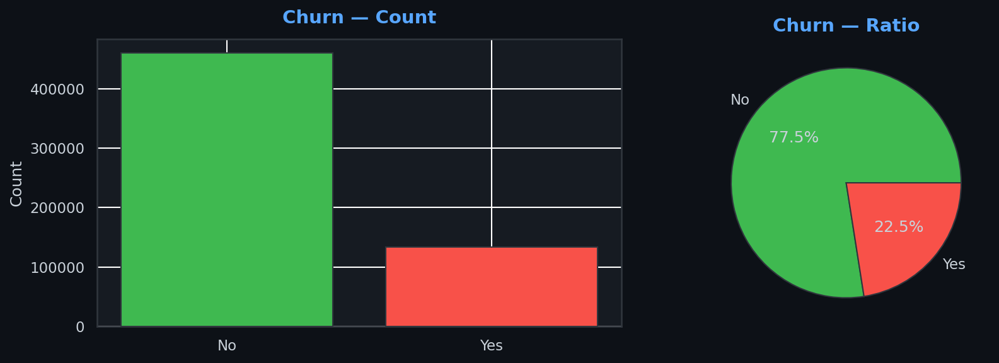
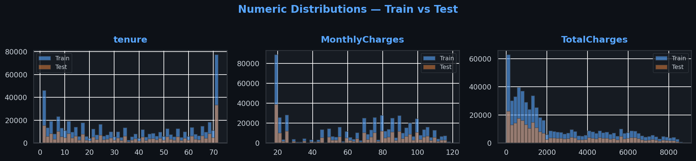
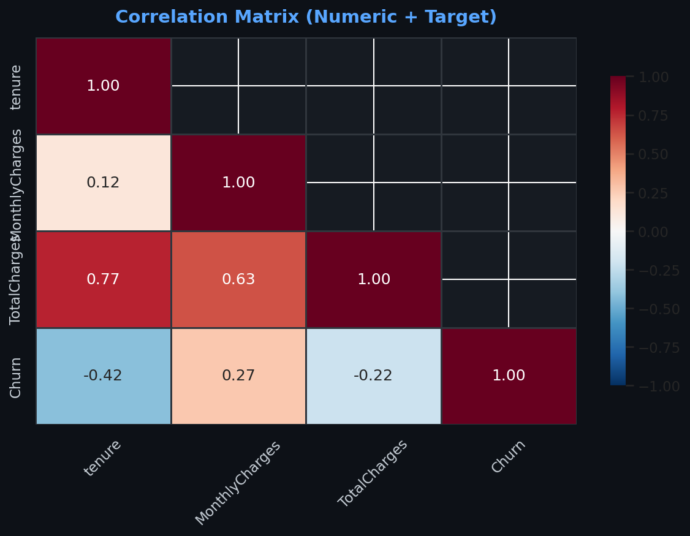
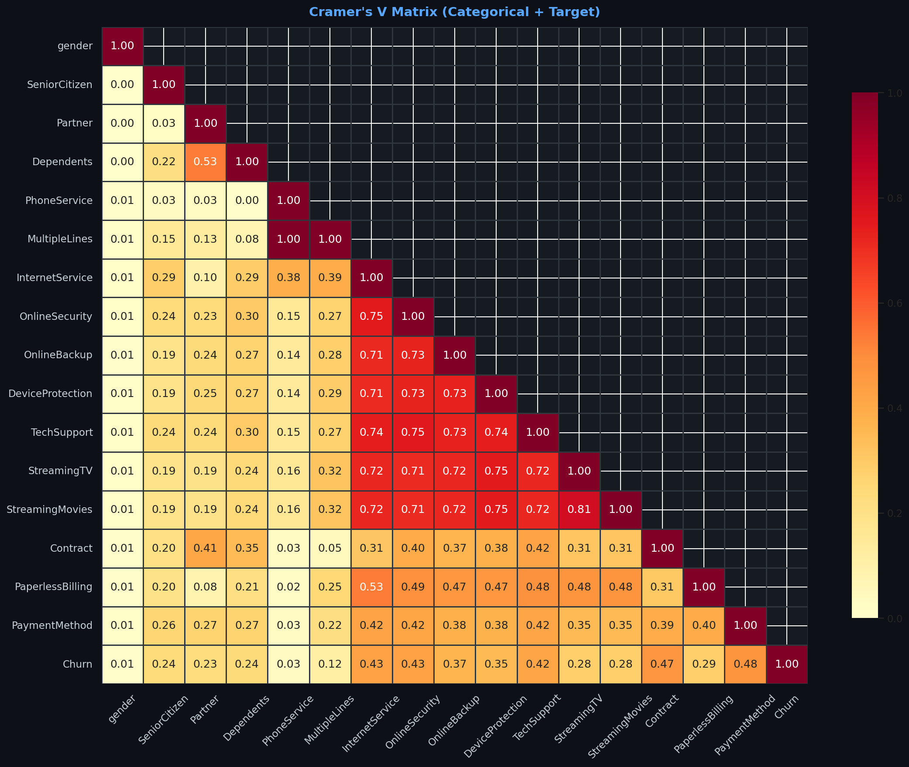
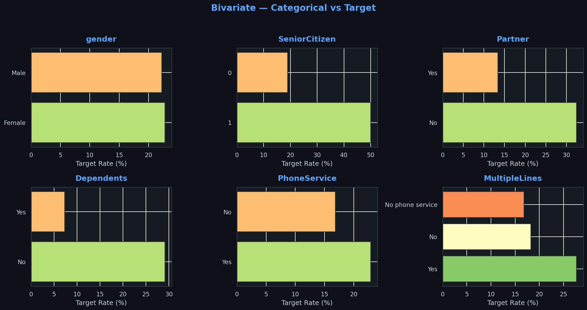
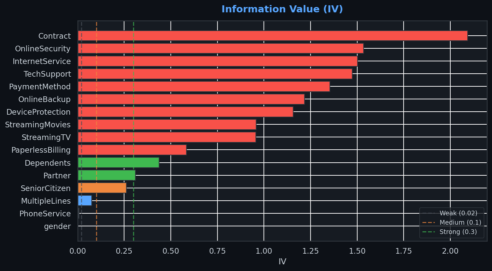
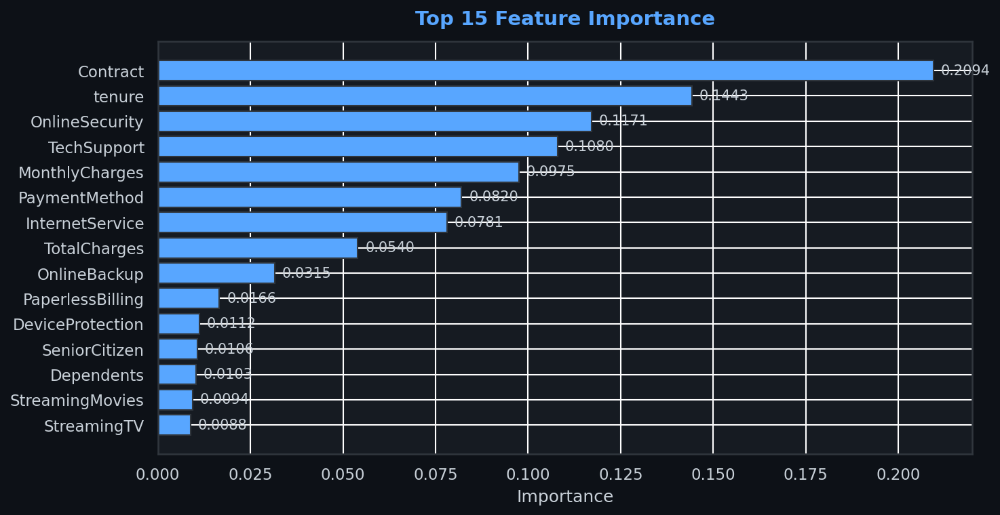

# 🚀 SENIOR DATA PIPELINE REPORT

---

## 📋 0. PIPELINE OVERVIEW

> 🚀 Pipeline | ID: id | Target: Churn

> 📊 19 Feature: 3 Numeric, 16 Categoric

> 🎯 Task: CLASSIFICATION (target 2 unique)

---

## 🌟 1. BELLEK VE BOYUT

> 📐 Train: 594,194 × 21 | 💾 546.2 MB

> 📐 Test: 254,655 × 20 | 💾 221.0 MB

---

## 🌟 2. GENEL VERİ AUDIT

|                  | Meta_Dtype   | Meta_Role   |   N-Unique_Train |   N-Unique_Test |   Null Pct_Train |   Null Pct_Test |   Top Val Pct_Train |   Top Val Pct_Test |   Diff_Null Gap |
|:-----------------|:-------------|:------------|-----------------:|----------------:|-----------------:|----------------:|--------------------:|-------------------:|----------------:|
| TotalCharges     | float64      | Numeric     |            31910 |           24995 |           0.0000 |          0.0000 |              0.1431 |             0.1398 |          0.0000 |
| MonthlyCharges   | float64      | Numeric     |             1921 |            1875 |           0.0000 |          0.0000 |              1.2514 |             1.2217 |          0.0000 |
| tenure           | int64        | Numeric     |               72 |              72 |           0.0000 |          0.0000 |              9.4937 |             9.4893 |          0.0000 |
| PaymentMethod    | object       | Categoric   |                4 |               4 |           0.0000 |          0.0000 |             36.2461 |            35.8222 |          0.0000 |
| MultipleLines    | object       | Categoric   |                3 |               3 |           0.0000 |          0.0000 |             47.6922 |            47.2215 |          0.0000 |
| InternetService  | object       | Categoric   |                3 |               3 |           0.0000 |          0.0000 |             45.8413 |            45.8389 |          0.0000 |
| OnlineSecurity   | object       | Categoric   |                3 |               3 |           0.0000 |          0.0000 |             48.7171 |            48.1801 |          0.0000 |
| OnlineBackup     | object       | Categoric   |                3 |               3 |           0.0000 |          0.0000 |             42.0878 |            41.3901 |          0.0000 |
| DeviceProtection | object       | Categoric   |                3 |               3 |           0.0000 |          0.0000 |             41.6324 |            41.1239 |          0.0000 |
| TechSupport      | object       | Categoric   |                3 |               3 |           0.0000 |          0.0000 |             48.5651 |            47.9653 |          0.0000 |
| StreamingTV      | object       | Categoric   |                3 |               3 |           0.0000 |          0.0000 |             40.4415 |            40.9747 |          0.0000 |
| StreamingMovies  | object       | Categoric   |                3 |               3 |           0.0000 |          0.0000 |             40.6324 |            41.2393 |          0.0000 |
| Contract         | object       | Categoric   |                3 |               3 |           0.0000 |          0.0000 |             50.3065 |            49.5612 |          0.0000 |
| gender           | object       | Categoric   |                2 |               2 |           0.0000 |          0.0000 |             50.2762 |            50.2386 |          0.0000 |
| SeniorCitizen    | int64        | Categoric   |                2 |               2 |           0.0000 |          0.0000 |             88.5898 |            88.6380 |          0.0000 |
| Partner          | object       | Categoric   |                2 |               2 |           0.0000 |          0.0000 |             52.0965 |            52.8963 |          0.0000 |
| Dependents       | object       | Categoric   |                2 |               2 |           0.0000 |          0.0000 |             69.7351 |            69.5121 |          0.0000 |
| PhoneService     | object       | Categoric   |                2 |               2 |           0.0000 |          0.0000 |             93.8907 |            93.9204 |          0.0000 |
| PaperlessBilling | object       | Categoric   |                2 |               2 |           0.0000 |          0.0000 |             61.5252 |            61.5067 |          0.0000 |

---

## 🌟 3. TARGET DAĞILIMI

| Churn   |       Count |   Pct (%) |     Bar |
|:--------|------------:|----------:|--------:|
| No      | 460377.0000 |   77.4792 | 77.4792 |
| Yes     | 133817.0000 |   22.5208 | 22.5208 |

> **⚠️ Orta dengesizlik. Min/Max: 0.291**

---

## 🌟 4. DUPLICATE & SABİT SÜTUN

> ✅ Duplicate yok.

> ✅ Sabit/quasi-sabit yok.

---

## 🌟 5. STATISTICAL RISK & DRIFT

| Sütun          |    Skew |   Outlier (%) |   KS-Stat |   P-Value | Drift                   |    VIF |   MI_Score |
|:---------------|--------:|--------------:|----------:|----------:|:------------------------|-------:|-----------:|
| tenure         |  0.0631 |        0.0000 |    0.0171 |    0.0000 | 🟡 Sadece İstatistiksel | 5.2231 |     0.1074 |
| MonthlyCharges | -0.2895 |        0.0000 |    0.0065 |    0.0000 | 🟡 Sadece İstatistiksel | 3.4864 |     0.0947 |
| TotalCharges   |  0.9092 |        0.0000 |    0.0177 |    0.0000 | 🟡 Sadece İstatistiksel | 7.2012 |     0.1383 |

---

## 🌟 6. NUMERİK KORELASYON

> ✅ |r|>0.85 çift yok.

|    | Feature        |   \|r\| with Churn |
|---:|:---------------|-----------------:|
|  0 | tenure         |           0.4185 |
|  1 | MonthlyCharges |           0.2730 |
|  2 | TotalCharges   |           0.2184 |

---

## 🌟 7. CRAMÉR'S V — KATEGORİK KORELASYON

> **⚠️ 24 çift V>0.5:**

|    | Feature_1        | Feature_2        |      V | Risk         |
|---:|:-----------------|:-----------------|-------:|:-------------|
|  0 | PhoneService     | MultipleLines    | 1.0000 | 🔴 Redundant |
|  1 | StreamingTV      | StreamingMovies  | 0.8113 | 🔴 Redundant |
|  2 | OnlineSecurity   | TechSupport      | 0.7541 | 🟡 High      |
|  3 | DeviceProtection | StreamingMovies  | 0.7487 | 🟡 High      |
|  4 | DeviceProtection | StreamingTV      | 0.7487 | 🟡 High      |
|  5 | InternetService  | OnlineSecurity   | 0.7469 | 🟡 High      |
|  6 | InternetService  | TechSupport      | 0.7404 | 🟡 High      |
|  7 | DeviceProtection | TechSupport      | 0.7404 | 🟡 High      |
|  8 | OnlineBackup     | TechSupport      | 0.7343 | 🟡 High      |
|  9 | OnlineBackup     | DeviceProtection | 0.7320 | 🟡 High      |
| 10 | OnlineSecurity   | OnlineBackup     | 0.7294 | 🟡 High      |
| 11 | OnlineSecurity   | DeviceProtection | 0.7281 | 🟡 High      |
| 12 | OnlineBackup     | StreamingMovies  | 0.7215 | 🟡 High      |
| 13 | OnlineBackup     | StreamingTV      | 0.7211 | 🟡 High      |
| 14 | TechSupport      | StreamingMovies  | 0.7194 | 🟡 High      |
| 15 | TechSupport      | StreamingTV      | 0.7192 | 🟡 High      |
| 16 | InternetService  | StreamingTV      | 0.7179 | 🟡 High      |
| 17 | InternetService  | StreamingMovies  | 0.7174 | 🟡 High      |
| 18 | InternetService  | OnlineBackup     | 0.7110 | 🟡 High      |
| 19 | OnlineSecurity   | StreamingMovies  | 0.7095 | 🟡 High      |
| 20 | OnlineSecurity   | StreamingTV      | 0.7094 | 🟡 High      |
| 21 | InternetService  | DeviceProtection | 0.7083 | 🟡 High      |
| 22 | InternetService  | PaperlessBilling | 0.5350 | 🟡 High      |
| 23 | Partner          | Dependents       | 0.5328 | 🟡 High      |

|                  |   V with Churn |
|:-----------------|---------------:|
| PaymentMethod    |         0.4763 |
| Contract         |         0.4721 |
| OnlineSecurity   |         0.4267 |
| InternetService  |         0.4259 |
| TechSupport      |         0.4164 |
| OnlineBackup     |         0.3651 |
| DeviceProtection |         0.3487 |
| PaperlessBilling |         0.2851 |
| StreamingMovies  |         0.2818 |
| StreamingTV      |         0.2816 |
| Dependents       |         0.2404 |
| SeniorCitizen    |         0.2364 |
| Partner          |         0.2282 |
| MultipleLines    |         0.1152 |
| PhoneService     |         0.0348 |
| gender           |         0.0068 |

---

## 🌟 8. HİYERARŞİK BAĞIMLILIK

> **⚠️ 37 hiyerarşik bağımlılık!**

|    | Child            | Sentinel            | Parent           | Parent_Val          |   Count |   Churn_Rate% |
|---:|:-----------------|:--------------------|:-----------------|:--------------------|--------:|--------------:|
|  0 | MultipleLines    | No phone service    | PhoneService     | No                  |   36301 |       16.8150 |
|  1 | OnlineSecurity   | No internet service | InternetService  | No                  |  140727 |        1.4311 |
|  2 | OnlineSecurity   | No internet service | OnlineBackup     | No internet service |  140727 |        1.4311 |
|  3 | OnlineSecurity   | No internet service | DeviceProtection | No internet service |  140727 |        1.4311 |
|  4 | OnlineSecurity   | No internet service | TechSupport      | No internet service |  140727 |        1.4311 |
|  5 | OnlineSecurity   | No internet service | StreamingTV      | No internet service |  140727 |        1.4311 |
|  6 | OnlineSecurity   | No internet service | StreamingMovies  | No internet service |  140727 |        1.4311 |
|  7 | OnlineBackup     | No internet service | InternetService  | No                  |  140727 |        1.4311 |
|  8 | OnlineBackup     | No internet service | OnlineSecurity   | No internet service |  140727 |        1.4311 |
|  9 | OnlineBackup     | No internet service | DeviceProtection | No internet service |  140727 |        1.4311 |
| 10 | OnlineBackup     | No internet service | TechSupport      | No internet service |  140727 |        1.4311 |
| 11 | OnlineBackup     | No internet service | StreamingTV      | No internet service |  140727 |        1.4311 |
| 12 | OnlineBackup     | No internet service | StreamingMovies  | No internet service |  140727 |        1.4311 |
| 13 | DeviceProtection | No internet service | InternetService  | No                  |  140727 |        1.4311 |
| 14 | DeviceProtection | No internet service | OnlineSecurity   | No internet service |  140727 |        1.4311 |
| 15 | DeviceProtection | No internet service | OnlineBackup     | No internet service |  140727 |        1.4311 |
| 16 | DeviceProtection | No internet service | TechSupport      | No internet service |  140727 |        1.4311 |
| 17 | DeviceProtection | No internet service | StreamingTV      | No internet service |  140727 |        1.4311 |
| 18 | DeviceProtection | No internet service | StreamingMovies  | No internet service |  140727 |        1.4311 |
| 19 | TechSupport      | No internet service | InternetService  | No                  |  140727 |        1.4311 |
| 20 | TechSupport      | No internet service | OnlineSecurity   | No internet service |  140727 |        1.4311 |
| 21 | TechSupport      | No internet service | OnlineBackup     | No internet service |  140727 |        1.4311 |
| 22 | TechSupport      | No internet service | DeviceProtection | No internet service |  140727 |        1.4311 |
| 23 | TechSupport      | No internet service | StreamingTV      | No internet service |  140727 |        1.4311 |
| 24 | TechSupport      | No internet service | StreamingMovies  | No internet service |  140727 |        1.4311 |
| 25 | StreamingTV      | No internet service | InternetService  | No                  |  140727 |        1.4311 |
| 26 | StreamingTV      | No internet service | OnlineSecurity   | No internet service |  140727 |        1.4311 |
| 27 | StreamingTV      | No internet service | OnlineBackup     | No internet service |  140727 |        1.4311 |
| 28 | StreamingTV      | No internet service | DeviceProtection | No internet service |  140727 |        1.4311 |
| 29 | StreamingTV      | No internet service | TechSupport      | No internet service |  140727 |        1.4311 |
| 30 | StreamingTV      | No internet service | StreamingMovies  | No internet service |  140727 |        1.4311 |
| 31 | StreamingMovies  | No internet service | InternetService  | No                  |  140727 |        1.4311 |
| 32 | StreamingMovies  | No internet service | OnlineSecurity   | No internet service |  140727 |        1.4311 |
| 33 | StreamingMovies  | No internet service | OnlineBackup     | No internet service |  140727 |        1.4311 |
| 34 | StreamingMovies  | No internet service | DeviceProtection | No internet service |  140727 |        1.4311 |
| 35 | StreamingMovies  | No internet service | TechSupport      | No internet service |  140727 |        1.4311 |
| 36 | StreamingMovies  | No internet service | StreamingTV      | No internet service |  140727 |        1.4311 |

> **💡 Sentinel → NaN veya parent ile merge et.**

---

## 🌟 9. TÜRETİLMİŞ FEATURE İLİŞKİLERİ

> **⚠️ 1 türetilmiş ilişki:**

|    | İlişki                  | Hedef        |    \|r\| | Tip     |
|---:|:------------------------|:-------------|-------:|:--------|
|  0 | tenure × MonthlyCharges | TotalCharges | 0.9921 | Product |

---

## 🌟 10. KATEGORİK OVERLAP

| Sütun            |     Tr |     Ts |   Overlap% |   Only_Test |
|:-----------------|-------:|-------:|-----------:|------------:|
| gender           | 2.0000 | 2.0000 |   100.0000 |      0.0000 |
| SeniorCitizen    | 2.0000 | 2.0000 |   100.0000 |      0.0000 |
| Partner          | 2.0000 | 2.0000 |   100.0000 |      0.0000 |
| Dependents       | 2.0000 | 2.0000 |   100.0000 |      0.0000 |
| PhoneService     | 2.0000 | 2.0000 |   100.0000 |      0.0000 |
| MultipleLines    | 3.0000 | 3.0000 |   100.0000 |      0.0000 |
| InternetService  | 3.0000 | 3.0000 |   100.0000 |      0.0000 |
| OnlineSecurity   | 3.0000 | 3.0000 |   100.0000 |      0.0000 |
| OnlineBackup     | 3.0000 | 3.0000 |   100.0000 |      0.0000 |
| DeviceProtection | 3.0000 | 3.0000 |   100.0000 |      0.0000 |
| TechSupport      | 3.0000 | 3.0000 |   100.0000 |      0.0000 |
| StreamingTV      | 3.0000 | 3.0000 |   100.0000 |      0.0000 |
| StreamingMovies  | 3.0000 | 3.0000 |   100.0000 |      0.0000 |
| Contract         | 3.0000 | 3.0000 |   100.0000 |      0.0000 |
| PaperlessBilling | 2.0000 | 2.0000 |   100.0000 |      0.0000 |
| PaymentMethod    | 4.0000 | 4.0000 |   100.0000 |      0.0000 |

---

## 🌟 11. TARGET BIVARIATE

|    | Feature          | Category                  |   Yes_Rate% |   Count |
|---:|:-----------------|:--------------------------|------------:|--------:|
|  0 | gender           | Female                    |     22.8036 |  298738 |
|  1 | gender           | Male                      |     22.2348 |  295456 |
|  2 | SeniorCitizen    | 0                         |     18.9774 |  526395 |
|  3 | SeniorCitizen    | 1                         |     50.0317 |   67799 |
|  4 | Partner          | No                        |     32.4621 |  284640 |
|  5 | Partner          | Yes                       |     13.3796 |  309554 |
|  6 | Dependents       | No                        |     29.1354 |  414362 |
|  7 | Dependents       | Yes                       |      7.2796 |  179832 |
|  8 | PhoneService     | No                        |     16.8150 |   36301 |
|  9 | PhoneService     | Yes                       |     22.8920 |  557893 |
| 10 | MultipleLines    | No                        |     18.2322 |  283384 |
| 11 | MultipleLines    | No phone service          |     16.8150 |   36301 |
| 12 | MultipleLines    | Yes                       |     27.7026 |  274509 |
| 13 | InternetService  | DSL                       |     10.3064 |  181081 |
| 14 | InternetService  | Fiber optic               |     41.5366 |  272386 |
| 15 | InternetService  | No                        |      1.4311 |  140727 |
| 16 | OnlineSecurity   | No                        |     40.6133 |  289474 |
| 17 | OnlineSecurity   | No internet service       |      1.4311 |  140727 |
| 18 | OnlineSecurity   | Yes                       |      8.6821 |  163993 |
| 19 | OnlineBackup     | No                        |     39.1026 |  250083 |
| 20 | OnlineBackup     | No internet service       |      1.4311 |  140727 |
| 21 | OnlineBackup     | Yes                       |     16.7240 |  203384 |
| 22 | DeviceProtection | No                        |     38.0630 |  247377 |
| 23 | DeviceProtection | No internet service       |      1.4311 |  140727 |
| 24 | DeviceProtection | Yes                       |     18.2658 |  206090 |
| 25 | TechSupport      | No                        |     40.1620 |  288571 |
| 26 | TechSupport      | No internet service       |      1.4311 |  140727 |
| 27 | TechSupport      | Yes                       |      9.6467 |  164896 |
| 28 | StreamingTV      | No                        |     29.7416 |  213166 |
| 29 | StreamingTV      | No internet service       |      1.4311 |  140727 |
| 30 | StreamingTV      | Yes                       |     28.4660 |  240301 |
| 31 | StreamingMovies  | No                        |     29.9299 |  212032 |
| 32 | StreamingMovies  | No internet service       |      1.4311 |  140727 |
| 33 | StreamingMovies  | Yes                       |     28.3066 |  241435 |
| 34 | Contract         | Month-to-month            |     42.0543 |  298918 |
| 35 | Contract         | One year                  |      5.7628 |  108333 |
| 36 | Contract         | Two year                  |      0.9982 |  186943 |
| 37 | PaperlessBilling | No                        |      7.4606 |  228615 |
| 38 | PaperlessBilling | Yes                       |     31.9387 |  365579 |
| 39 | PaymentMethod    | Bank transfer (automatic) |      7.7093 |  121360 |
| 40 | PaymentMethod    | Credit card (automatic)   |      6.9332 |  133705 |
| 41 | PaymentMethod    | Electronic check          |     48.9052 |  215372 |
| 42 | PaymentMethod    | Mailed check              |      7.9697 |  123757 |

---

## 🌟 12. INFORMATION VALUE (IV)

|                  |     IV | Strength      |
|:-----------------|-------:|:--------------|
| Contract         | 2.0927 | 🔴 Suspicious |
| OnlineSecurity   | 1.5346 | 🔴 Suspicious |
| InternetService  | 1.5023 | 🔴 Suspicious |
| TechSupport      | 1.4738 | 🔴 Suspicious |
| PaymentMethod    | 1.3534 | 🔴 Suspicious |
| OnlineBackup     | 1.2169 | 🔴 Suspicious |
| DeviceProtection | 1.1577 | 🔴 Suspicious |
| StreamingMovies  | 0.9574 | 🔴 Suspicious |
| StreamingTV      | 0.9569 | 🔴 Suspicious |
| PaperlessBilling | 0.5849 | 🔴 Suspicious |
| Dependents       | 0.4377 | 🟢 Strong     |
| Partner          | 0.3098 | 🟢 Strong     |
| SeniorCitizen    | 0.2614 | 🟡 Medium     |
| MultipleLines    | 0.0762 | 🔵 Weak       |
| PhoneService     | 0.0077 | ⚪ Useless    |
| gender           | 0.0003 | ⚪ Useless    |

> **⚠️ IV>0.5 leakage riski: ['Contract', 'OnlineSecurity', 'InternetService', 'TechSupport', 'PaymentMethod', 'OnlineBackup', 'DeviceProtection', 'StreamingMovies', 'StreamingTV', 'PaperlessBilling']**

---

## 🌟 13. ADVERSARIAL & FEATURE IMPORTANCE

> 🕵️ Adversarial AUC: 0.5104 — ✅ Güvenli.

|    | Feature          |   Importance |   Cumulative |   Rank |
|---:|:-----------------|-------------:|-------------:|-------:|
|  0 | Contract         |       0.2094 |       0.2094 |      1 |
|  1 | tenure           |       0.1443 |       0.3537 |      2 |
|  2 | OnlineSecurity   |       0.1171 |       0.4708 |      3 |
|  3 | TechSupport      |       0.1080 |       0.5788 |      4 |
|  4 | MonthlyCharges   |       0.0975 |       0.6762 |      5 |
|  5 | PaymentMethod    |       0.0820 |       0.7582 |      6 |
|  6 | InternetService  |       0.0781 |       0.8363 |      7 |
|  7 | TotalCharges     |       0.0540 |       0.8903 |      8 |
|  8 | OnlineBackup     |       0.0315 |       0.9218 |      9 |
|  9 | PaperlessBilling |       0.0166 |       0.9385 |     10 |
| 10 | DeviceProtection |       0.0112 |       0.9497 |     11 |
| 11 | SeniorCitizen    |       0.0106 |       0.9603 |     12 |
| 12 | Dependents       |       0.0103 |       0.9705 |     13 |
| 13 | StreamingMovies  |       0.0094 |       0.9799 |     14 |
| 14 | StreamingTV      |       0.0088 |       0.9888 |     15 |
| 15 | MultipleLines    |       0.0065 |       0.9952 |     16 |
| 16 | Partner          |       0.0040 |       0.9992 |     17 |
| 17 | PhoneService     |       0.0008 |       0.9999 |     18 |
| 18 | gender           |       0.0001 |       1.0000 |     19 |

> **🗑️ Imp<0.005 + Dom>90%: {'PhoneService'}**

> 📊 Top 80% bilgi: 6 feature → ['Contract', 'tenure', 'OnlineSecurity', 'TechSupport', 'MonthlyCharges', 'PaymentMethod']

---

## 🌟 14. MISSING VALUE PATERNLERİ

> ✅ Missing yok.

---

## 🌟 15. PLAYGROUND SERIES — ORİJİNAL VERİ

> 📌 Playground Series → orijinal veri augmentation yapılabilir.

> 📌 Bu veri → IBM Telco Customer Churn (Kaggle'da mevcut).

> **💡 pd.concat([train, original]) + source flag ekle.**

---

## 🎯 16. AKSİYON ÖZETİ — NE YAPMALI?

>   1. ⚖️ Hafif imbalance → class_weight='balanced'

>   2. 🔗 Redundant kategorik: [('PhoneService', 'MultipleLines'), ('StreamingTV', 'StreamingMovies')]

>   3. 🔗 Hiyerarşik: ['MultipleLines', 'OnlineSecurity', 'OnlineBackup', 'DeviceProtection', 'TechSupport', 'StreamingTV', 'StreamingMovies']

>   4. 🔗 Türetilmiş: ['TotalCharges'] → Residual

> **  5. 🚨 IV suspicious: ['Contract', 'OnlineSecurity', 'InternetService', 'TechSupport', 'PaymentMethod', 'OnlineBackup', 'DeviceProtection', 'StreamingMovies', 'StreamingTV', 'PaperlessBilling']**

>   6. 📉 IV<0.02: ['PhoneService', 'gender']

>   7. 🗑️ Useless: {'PhoneService'}

>   8. 📉 Imp<0.01: ['StreamingMovies', 'StreamingTV', 'MultipleLines', 'Partner', 'PhoneService']...

>   9. 📦 Orijinal veri augmentation

> 

> 📌 Önerilen sonraki adımlar:

>   1️⃣ Sentinel'leri NaN'a çevir

>   2️⃣ Orijinal veri augment

>   3️⃣ FE: residual, interaction, aggregation

>   4️⃣ Target / CatBoost encoding

>   5️⃣ Baseline: LGB + StratifiedKFold

>   6️⃣ Optuna tuning

>   7️⃣ Ensemble: LGB + XGB + CatBoost

