# Code

```python
import pandas as pd
import numpy as np
import seaborn as sns
import matplotlib.pyplot as plt
from sklearn.feature_selection import mutual_info_classif, f_classif
from scipy.stats import chi2_contingency
from sklearn.model_selection import StratifiedKFold
from sklearn.base import clone
from xgboost import XGBClassifier
from category_encoders import TargetEncoder   # ⚡ leakage'i önleyen CV'li encoder
from itertools import combinations
import warnings
warnings.filterwarnings('ignore')

# =========================
# 0. VERİ YÜKLEME
# =========================
df = pd.read_csv("/kaggle/input/competitions/playground-series-s6e4/train.csv")

target = "Irrigation_Need"
df = df.drop("id", axis=1)
df[target] = df[target].map({"Low": 0, "Medium": 1, "High": 2})

print("="*80)
print("🔍 TEMEL BİLGİLER")
print("="*80)
print(f"Shape: {df.shape}")
print(f"Duplicates: {df.duplicated().sum()}")
print(f"\nMemory usage: {df.memory_usage(deep=True).sum() / 1024**2:.2f} MB")

# =========================
# 1. HEDEF DAĞILIMI
# =========================
print("\n" + "="*80)
print("🎯 HEDEF SINIF DAĞILIMI")
print("="*80)
target_counts = df[target].value_counts().sort_index()
target_pcts = ((df[target].value_counts(normalize=True).sort_index())*100).round(2)
target_stats = pd.DataFrame({
    'Count': target_counts,
    'Percentage': target_pcts,
    'Imbalance_Ratio': (target_counts.max() / target_counts).round(2)
})
print(target_stats)

# =========================
# 2. EKSİK DEĞER ANALİZİ
# =========================
print("\n" + "="*80)
print("⚠️ EKSİK DEĞER ANALİZİ")
print("="*80)
missing = df.isnull().sum()
missing_pct = (missing / len(df)) * 100
missing_df = pd.DataFrame({'Count': missing, 'Percentage': missing_pct})
missing_df = missing_df[missing_df['Count'] > 0].sort_values('Count', ascending=False)

if len(missing_df) > 0:
    print(missing_df.to_string())
else:
    print("✅ Hiç eksik değer yok!")

# =========================
# 3. SÜTUN TİPLERİ VE KARDİNALİTE
# =========================
num_cols = df.select_dtypes(include=np.number).columns.tolist()
if target in num_cols: 
    num_cols.remove(target)

cat_cols = df.select_dtypes(include=['object', 'category']).columns.tolist()
if target in cat_cols: 
    cat_cols.remove(target)

print("\n" + "="*80)
print("📊 SÜTUN BİLGİLERİ")
print("="*80)
col_info = pd.DataFrame({
    'Type': ['Numerical']*len(num_cols) + ['Categorical']*len(cat_cols),
    'Unique': [df[c].nunique() for c in num_cols] + [df[c].nunique() for c in cat_cols],
    'Dtype': [df[c].dtype for c in num_cols] + [df[c].dtype for c in cat_cols]
}, index=num_cols + cat_cols)
print(col_info.to_string())

print(f"\n📊 Sayısal sütunlar ({len(num_cols)}): {num_cols}")
print(f"\n📊 Kategorik sütunlar ({len(cat_cols)}): {cat_cols}")

# =========================
# 4. SAYISAL DEĞİŞKEN ANALİZİ (SINIF BAZINDA)
# =========================
print("\n" + "="*80)
print("📈 SAYISAL DEĞİŞKENLER - SINIF BAZINDA İSTATİSTİKLER")
print("="*80)

for col in num_cols:
    print(f"\n{'─'*60}")
    print(f"📌 {col}")
    print(f"{'─'*60}")
    
    group_stats = df.groupby(target)[col].describe(
        percentiles=[0.01, 0.05, 0.10, 0.25, 0.50, 0.75, 0.90, 0.95, 0.99]
    ).round(3)
    print(group_stats.to_string())
    
    Q1 = df[col].quantile(0.01)
    Q3 = df[col].quantile(0.99)
    outliers = df[(df[col] < Q1) | (df[col] > Q3)]
    
    print(f"\n   Aykırı değer sayısı (<1% veya >99%): {len(outliers)} ({len(outliers)/len(df)*100:.2f}%)")
    if len(outliers) > 0:
        outlier_dist = outliers[target].value_counts().sort_index()
        print(f"   Aykırı değerlerin sınıf dağılımı: {outlier_dist.to_dict()}")
    
    fig, axes = plt.subplots(1, 3, figsize=(24, 6))
    
    sns.histplot(data=df, x=col, hue=target, bins=40, kde=True, ax=axes[0], palette="Set2")
    axes[0].set_title(f'{col}\nDistribution by Class', fontsize=12, fontweight='bold')
    
    sns.boxplot(data=df, x=target, y=col, ax=axes[1], palette="Set2")
    axes[1].set_title(f'{col}\nBoxplot by Class', fontsize=12, fontweight='bold')
    
    # ⚡ Düzeltme: violin plot'ta hue kaldırıldı (aynı değişken x ve hue olamaz uyarısı)
    sns.violinplot(data=df.sample(min(10000, len(df))), x=target, y=col, 
                   palette='Set2', ax=axes[2])
    axes[2].set_title(f'{col}\nViolin Plot', fontsize=12, fontweight='bold')
    
    plt.tight_layout()
    plt.savefig(f"eda_{col}.png")   # çakışmayı önlemek için prefix
    plt.show()

# =========================
# 5. KATEGORİK DEĞİŞKEN ANALİZİ
# =========================
print("\n" + "="*80)
print("📊 KATEGORİK DEĞİŞKENLER - SINIF BAZINDA ANALİZ")
print("="*80)

for col in cat_cols:
    print(f"\n{'─'*60}")
    print(f"📌 {col}")
    print(f"{'─'*60}")
    
    cat_stats = df.groupby(col).agg(
        count=(col, 'count'),
        target_mean=(target, 'mean'),
        target_std=(target, 'std')
    ).round(4)
    cat_stats['count_pct'] = (cat_stats['count'] / len(df) * 100).round(2)
    cat_stats = cat_stats.sort_values('target_mean', ascending=False)
    print(cat_stats.to_string())
    
    fig, axes = plt.subplots(1, 3, figsize=(27, 8))
    
    cat_stats['count'].plot(kind='bar', ax=axes[0], color='steelblue', edgecolor='black')
    axes[0].set_title(f'{col}\nFrequency', fontsize=12, fontweight='bold')
    axes[0].tick_params(axis='x', rotation=45)
    
    colors_bar = ['#e74c3c' if x > 0.5 else '#2ecc71' if x < 0.3 else '#f39c12' 
                  for x in cat_stats['target_mean']]
    cat_stats['target_mean'].plot(kind='bar', ax=axes[1], color=colors_bar, edgecolor='black')
    axes[1].set_title(f'{col}\nMean Target Value', fontsize=12, fontweight='bold')
    axes[1].axhline(y=df[target].mean(), color='black', linestyle='--', alpha=0.5, label='Global Mean')
    axes[1].legend()
    axes[1].tick_params(axis='x', rotation=45)
    
    crosstab_norm = pd.crosstab(df[col], df[target], normalize='index')
    crosstab_norm.plot(kind='bar', stacked=True, ax=axes[2], colormap='Set2', edgecolor='black')
    axes[2].set_title(f'{col}\nClass Distribution', fontsize=12, fontweight='bold')
    axes[2].legend(['Low', 'Medium', 'High'])
    axes[2].tick_params(axis='x', rotation=45)
    axes[2].set_ylabel('Proportion')
    
    plt.tight_layout()
    plt.savefig(f"eda_{col}.png")
    plt.show()

# =========================
# 6. TEK DEĞİŞKENLİ ÖNEM ANALİZİ
# =========================
print("\n" + "="*80)
print("📊 TEK DEĞİŞKENLİ ÖNEM ANALİZİ")
print("="*80)

# SAYISAL
num_importance = pd.DataFrame(index=num_cols)
f_values, p_values = [], []
for col in num_cols:
    f, p = f_classif(df[[col]].fillna(df[col].median()), df[target])
    f_values.append(f[0])
    p_values.append(p[0])

num_importance["F_value"] = f_values
num_importance["F_pvalue"] = p_values
num_importance["Mutual_Info"] = mutual_info_classif(
    df[num_cols].fillna(df[num_cols].median()), df[target], random_state=42
)
num_importance = num_importance.sort_values("Mutual_Info", ascending=False)
num_importance["MI_Rank"] = range(1, len(num_importance) + 1)
print("\n📈 Sayısal Değişken Önem Sıralaması:")
print(num_importance.round(4).to_string())

# KATEGORİK
cat_importance = pd.DataFrame(index=cat_cols)
chi2_stats = []
for col in cat_cols:
    contingency = pd.crosstab(df[col], df[target])
    chi2, p, dof, _ = chi2_contingency(contingency)
    chi2_stats.append([chi2, p])
cat_importance["Chi2"] = [x[0] for x in chi2_stats]
cat_importance["p_value"] = [x[1] for x in chi2_stats]
cat_importance = cat_importance.sort_values("Chi2", ascending=False)
cat_importance["Chi2_Rank"] = range(1, len(cat_importance) + 1)
print("\n📊 Kategorik Değişken Önem Sıralaması:")
print(cat_importance.round(4).to_string())

# GÖRSELLEŞTİRME
fig, axes = plt.subplots(1, 2, figsize=(16, 6))
axes[0].barh(num_importance.index[::-1], num_importance["Mutual_Info"][::-1], 
             color="steelblue", edgecolor="black")
axes[0].set_title("Numerical Features\nMutual Information", fontsize=14, fontweight="bold")
axes[1].barh(cat_importance.index[::-1], cat_importance["Chi2"][::-1], 
             color="coral", edgecolor="black")
axes[1].set_title("Categorical Features\nChi-Square Score", fontsize=14, fontweight="bold")
plt.tight_layout()
plt.savefig("univariate_importance.png", dpi=300, bbox_inches="tight")
plt.show()

# =========================
# 7. KORELASYON ANALİZİ
# =========================
print("\n" + "="*80)
print("📊 KORELASYON ANALİZİ")
print("="*80)

corr_matrix = df[num_cols + [target]].corr()
plt.figure(figsize=(12, 10))
mask = np.triu(np.ones_like(corr_matrix, dtype=bool), k=1)
sns.heatmap(corr_matrix, mask=mask, annot=True, fmt='.2f', cmap='RdBu_r',
            center=0, square=True, linewidths=0.5, cbar_kws={'shrink': 0.8})
plt.title('Correlation Matrix (Numerical + Target)', fontsize=14, fontweight='bold')
plt.tight_layout()
plt.savefig("correlation_matrix.png")
plt.show()

high_corr = []
for i in range(len(corr_matrix.columns)):
    for j in range(i+1, len(corr_matrix.columns)):
        if abs(corr_matrix.iloc[i, j]) > 0.7:
            high_corr.append({
                'Feature1': corr_matrix.columns[i],
                'Feature2': corr_matrix.columns[j],
                'Correlation': corr_matrix.iloc[i, j]
            })

if high_corr:
    print("\n⚠️ YÜKSEK KORELASYONLU ÇİFTLER (|r| > 0.7):")
    print(pd.DataFrame(high_corr).sort_values('Correlation', ascending=False).to_string())
else:
    print("\n✅ Yüksek korelasyonlu çift yok (|r| > 0.7)")

# =========================
# 8. İKİLİ ETKİLEŞİM GÖRSELLERİ (SADECE EN ÖNEMLİ 5)
# =========================
print("\n" + "="*80)
print("📊 İKİLİ ETKİLEŞİM ANALİZİ (Top 5 Sayısal)")
print("="*80)

top_num_cols = num_importance.head(5).index.tolist()
pairs = list(combinations(top_num_cols, 2))   # ⚡ sadece 10 çift
sample_df = df.sample(min(5000, len(df)), random_state=42)
colors = ['#2ecc71', '#3498db', '#e74c3c']

n_cols = 3
n_rows = (len(pairs) + n_cols - 1) // n_cols
fig, axes = plt.subplots(n_rows, n_cols, figsize=(18, 5 * n_rows))
axes = axes.flatten()

for idx, (col1, col2) in enumerate(pairs):
    ax = axes[idx]
    for class_val, color in zip(sorted(df[target].unique()), colors):
        subset = sample_df[sample_df[target] == class_val]
        ax.scatter(subset[col1], subset[col2], c=color, alpha=0.5, s=12, label=f'Class {class_val}')
    ax.set_title(f'{col1} vs {col2}', fontsize=11, fontweight='bold')
    ax.set_xlabel(col1)
    ax.set_ylabel(col2)
    if idx == 0:
        ax.legend()

for idx in range(len(pairs), len(axes)):
    axes[idx].remove()

plt.suptitle('Top 5 Numerical Feature Interactions', fontsize=16, fontweight='bold')
plt.tight_layout()
plt.savefig("top_interactions.png", dpi=300, bbox_inches='tight')
plt.show()

# =========================
# 9. NULL IMPORTANCE (LEAKAGE FREE)
# =========================
print("\n" + "="*80)
print("📊 NULL IMPORTANCE ANALİZİ (CV‑Target Encoding ile)")
print("="*80)

# ⚡ Düzeltme: category_encoders.TargetEncoder kullanarak leakage'i engelle
# cv=5 parametresi, encoding sırasında 5‑fold out‑of‑fold transform yapar.
# Bu sayede tüm veriye fit edilse bile her satır kendisi dışındaki fold'lardan öğrenilir.
encoder = TargetEncoder(cols=cat_cols, smoothing=0.1)  # smoothing hafif düzenlilik katar
X_encoded = encoder.fit_transform(df[num_cols + cat_cols], df[target])
y = df[target].values

print(f"Encoded features: {X_encoded.shape[1]}")

def get_model():
    return XGBClassifier(
        n_estimators=150,         # ⚡ hız için düşürüldü
        max_depth=4,
        learning_rate=0.05,
        tree_method='hist',
        eval_metric='mlogloss',
        random_state=42,
        verbosity=0
    )

def compute_feature_importances(X, y, model, n_splits=5):
    """Gerçek önem: 5‑fold CV ortalaması (leakage yok)"""
    importances = np.zeros((n_splits, X.shape[1]))
    cv = StratifiedKFold(n_splits=n_splits, shuffle=True, random_state=42)
    
    for i, (tr_idx, va_idx) in enumerate(cv.split(X, y)):
        X_tr, y_tr = X.iloc[tr_idx], y[tr_idx]
        m = clone(model)
        m.fit(X_tr, y_tr)
        importances[i] = m.feature_importances_
    return importances.mean(axis=0)

def compute_null_importances(X, y, model, n_splits=5, n_shuffles=5):
    """
    Null importance: hedef shuffle edilir, yine CV ile eğitilir.
    Toplam model sayısı = n_splits * n_shuffles
    """
    null_imps = np.zeros((n_shuffles * n_splits, X.shape[1]))
    cv = StratifiedKFold(n_splits=n_splits, shuffle=True, random_state=42)
    
    run_idx = 0
    for fold, (tr_idx, va_idx) in enumerate(cv.split(X, y)):
        for shuffle_num in range(n_shuffles):
            y_shuffled = y.copy()
            np.random.shuffle(y_shuffled)
            
            X_tr = X.iloc[tr_idx]
            y_tr = y_shuffled[tr_idx]
            
            m = clone(model)
            m.fit(X_tr, y_tr)
            null_imps[run_idx] = m.feature_importances_
            run_idx += 1
        
        print(f"  Fold {fold+1}/{n_splits} tamamlandı (toplam {run_idx} model)")
    
    return null_imps

# Hızlı modelle hesapla
print("\n📈 Gerçek feature importance hesaplanıyor...")
model = get_model()
actual_imp = compute_feature_importances(X_encoded, y, model, n_splits=5)

print("\n📉 Null importance hesaplanıyor (5 shuffle × 5 fold = 25 model)...")
null_imps = compute_null_importances(X_encoded, y, model, n_splits=5, n_shuffles=5)

# İstatistikler
null_mean = null_imps.mean(axis=0)
null_std = null_imps.std(axis=0)
null_95 = np.percentile(null_imps, 95, axis=0)
null_99 = np.percentile(null_imps, 99, axis=0)

# Daha güvenilir score: actual / null_95th (percentile‑based)
safe_score = actual_imp / (null_95 + 1e-10)
z_score = (actual_imp - null_mean) / (null_std + 1e-10)   # ek bilgi, ama sıralamada kullanma

null_importance_df = pd.DataFrame({
    'feature': X_encoded.columns,
    'actual_importance': actual_imp,
    'null_mean': null_mean,
    'null_95th': null_95,
    'null_99th': null_99,
    'safe_score': safe_score,               # >1 ise gerçek sinyal
    'z_score': z_score,
    'is_significant': actual_imp > null_99,  # %99 güvenle gerçek
    'is_better_than_95': actual_imp > null_95
}).sort_values('safe_score', ascending=False)

print("\n📊 NULL IMPORTANCE SONUÇLARI (safe_score ile sıralı):")
print(null_importance_df[['feature', 'actual_importance', 'null_95th', 'safe_score', 'is_significant']].round(6).to_string())

print(f"\n✅ Gerçekten önemli özellikler (actual > null_99th): {null_importance_df['is_significant'].sum()}")
print(f"✅ 95th'den iyi özellikler: {null_importance_df['is_better_than_95'].sum()}")
print(f"❌ Gürültü olabilecekler: {(~null_importance_df['is_significant']).sum()}")

# Görsel
fig, axes = plt.subplots(1, 2, figsize=(18, 8))

# Sol: Actual vs Null
top_features = null_importance_df.head(20).sort_values('actual_importance')
x = np.arange(len(top_features))
width = 0.35

axes[0].barh(x - width/2, top_features['actual_importance'], width, 
            label='Actual', color='steelblue', edgecolor='black')
axes[0].barh(x + width/2, top_features['null_mean'], width, 
            label='Null (mean)', color='coral', edgecolor='black')

axes[0].set_yticks(x)
axes[0].set_yticklabels(top_features['feature'])
axes[0].set_xlabel('Importance')
axes[0].set_title('Actual vs Null Importance (Top 20)', fontsize=14, fontweight='bold')
axes[0].legend(loc='lower right')

# Sağ: Safe Score
colors_score = ['#2ecc71' if s > 1 else '#e74c3c' for s in null_importance_df['safe_score']]
axes[1].barh(null_importance_df['feature'][::-1], null_importance_df['safe_score'][::-1],
            color=colors_score[::-1], edgecolor='black')
axes[1].axvline(x=1, color='black', linestyle='-', alpha=0.5, label='Safe threshold = 1')
axes[1].set_xlabel('Safe Score (actual / null_95th)')
axes[1].set_title('Feature Reliability Score\n(>1 = true signal)', fontsize=14, fontweight='bold')
axes[1].legend()

plt.tight_layout()
plt.savefig("null_importance_safe.png", dpi=300, bbox_inches='tight')
plt.show()

significant_features = null_importance_df[null_importance_df['is_significant']]['feature'].tolist()
noise_features = null_importance_df[~null_importance_df['is_significant']]['feature'].tolist()

print(f"\n💡 ÖNERİLEN ÖZELLİKLER (istatistiksel anlamlı):")
print(f"   {significant_features}")

if len(noise_features) > 0:
    print(f"\n⚠️ ATILABİLİR ÖZELLİKLER (gürültü seviyesinde):")
    print(f"   {noise_features}")

# =========================
# 10. ÖZET VE ÖNERİLER
# =========================
print("\n" + "="*80)
print("📋 EDA ÖZETİ VE FEATURE ENGINEERING ÖNERİLERİ")
print("="*80)

print(f"""
🔍 VERİ SETİ ÖZETİ:
   • Toplam satır: {len(df):,}
   • Sayısal: {len(num_cols)}, Kategorik: {len(cat_cols)}
   • Hedef dengesizlik: {target_stats['Imbalance_Ratio'].max():.1f}x

📊 SAYISAL ÖZELLİKLER (Mutual Info sıralı):
""")
for idx, row in num_importance.iterrows():
    print(f"   {row['MI_Rank']:.0f}. {idx}: {row['Mutual_Info']:.4f}")

print(f"\n📊 KATEGORİK ÖZELLİKLER (Chi-Square sıralı):")
for idx, row in cat_importance.iterrows():
    print(f"   {row['Chi2_Rank']:.0f}. {idx}: {row['Chi2']:.2f}")

print(f"\n📊 NULL IMPORTANCE (safe_score > 1):")
for idx, row in null_importance_df[null_importance_df['is_significant']].iterrows():
    print(f"   ✓ {row['feature']}: safe_score={row['safe_score']:.2f}")

print(f"""
💡 FEATURE ENGINEERING ÖNERİLERİ:
   1. Top-4 sayısal özellik arası çarpım/bölüm etkileşimleri
   2. Crop_Growth_Stage, Mulching_Used kombinasyonları
   3. Soil_Moisture < 25, Temperature > 30 eşikleri
   4. Evapotranspirasyon: (T * Wind) / (Humidity + 1)
   5. Null importance'ta gürültü çıkan özellikleri ele
""")

!zip -r eda_results_fixed.zip /kaggle/working -i "*.png"
print("\n✅ Tüm düzeltilmiş sonuçlar 'eda_results_fixed.zip' içinde.")
```

# Results
```python
================================================================================
🔍 TEMEL BİLGİLER
================================================================================
Shape: (630000, 20)
Duplicates: 0

Memory usage: 320.42 MB

================================================================================
🎯 HEDEF SINIF DAĞILIMI
================================================================================
                  Count  Percentage  Imbalance_Ratio
Irrigation_Need                                     
0                369917       58.72             1.00
1                239074       37.95             1.55
2                 21009        3.33            17.61

================================================================================
⚠️ EKSİK DEĞER ANALİZİ
================================================================================
✅ Hiç eksik değer yok!

================================================================================
📊 SÜTUN BİLGİLERİ
================================================================================
                                Type  Unique    Dtype
Soil_pH                    Numerical     341  float64
Soil_Moisture              Numerical    5223  float64
Organic_Carbon             Numerical     131  float64
Electrical_Conductivity    Numerical     341  float64
Temperature_C              Numerical    2934  float64
Humidity                   Numerical    6475  float64
Rainfall_mm                Numerical   19308  float64
Sunlight_Hours             Numerical     701  float64
Wind_Speed_kmh             Numerical    1935  float64
Field_Area_hectare         Numerical    1466  float64
Previous_Irrigation_mm     Numerical   10110  float64
Soil_Type                Categorical       4   object
Crop_Type                Categorical       6   object
Crop_Growth_Stage        Categorical       4   object
Season                   Categorical       3   object
Irrigation_Type          Categorical       4   object
Water_Source             Categorical       4   object
Mulching_Used            Categorical       2   object
Region                   Categorical       5   object

📊 Sayısal sütunlar (11): ['Soil_pH', 'Soil_Moisture', 'Organic_Carbon', 'Electrical_Conductivity', 'Temperature_C', 'Humidity', 'Rainfall_mm', 'Sunlight_Hours', 'Wind_Speed_kmh', 'Field_Area_hectare', 'Previous_Irrigation_mm']

📊 Kategorik sütunlar (8): ['Soil_Type', 'Crop_Type', 'Crop_Growth_Stage', 'Season', 'Irrigation_Type', 'Water_Source', 'Mulching_Used', 'Region']

================================================================================
📈 SAYISAL DEĞİŞKENLER - SINIF BAZINDA İSTATİSTİKLER
================================================================================

────────────────────────────────────────────────────────────
📌 Soil_pH
────────────────────────────────────────────────────────────
                    count   mean    std  min    1%    5%   10%   25%   50%   75%   90%   95%   99%  max
Irrigation_Need                                                                                        
0                369917.0  6.488  0.917  4.8  4.87  5.07  5.23  5.70  6.46  7.25  7.77  7.94  8.12  8.2
1                239074.0  6.466  0.926  4.8  4.87  5.06  5.23  5.67  6.40  7.25  7.79  7.96  8.12  8.2
2                 21009.0  6.578  0.979  4.8  4.86  5.05  5.23  5.67  6.59  7.53  7.84  7.97  8.11  8.2

   Aykırı değer sayısı (<1% veya >99%): 11324 (1.80%)
   Aykırı değerlerin sınıf dağılımı: {0: 6761, 1: 4172, 2: 391}
```
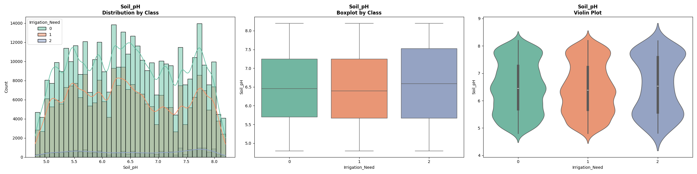
```
────────────────────────────────────────────────────────────
📌 Soil_Moisture
────────────────────────────────────────────────────────────
                    count    mean     std   min     1%     5%    10%    25%    50%    75%    90%    95%     99%    max
Irrigation_Need                                                                                                       
0                369917.0  43.306  13.421  8.01  10.59  20.38  26.23  33.03  44.01  54.31  60.97  63.17  64.710  64.99
1                239074.0  29.744  16.625  8.00   8.34   9.65  11.48  16.03  23.89  43.66  56.37  60.01  64.300  64.99
2                 21009.0  17.670   7.480  8.01   8.22   9.00   9.95  12.14  17.09  21.67  24.23  24.75  51.875  64.99

   Aykırı değer sayısı (<1% veya >99%): 12359 (1.96%)
   Aykırı değerlerin sınıf dağılımı: {0: 5690, 1: 5954, 2: 715}
```
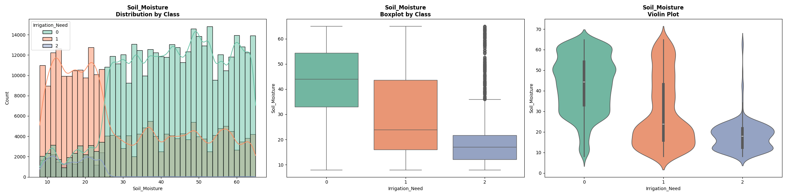
```
────────────────────────────────────────────────────────────
📌 Organic_Carbon
────────────────────────────────────────────────────────────
                    count   mean    std  min    1%    5%   10%   25%   50%   75%   90%   95%   99%  max
Irrigation_Need                                                                                        
0                369917.0  0.921  0.366  0.3  0.32  0.38  0.44  0.61  0.90  1.22  1.46  1.52  1.58  1.6
1                239074.0  0.926  0.365  0.3  0.32  0.37  0.43  0.61  0.93  1.23  1.44  1.51  1.58  1.6
2                 21009.0  0.924  0.374  0.3  0.33  0.37  0.41  0.58  0.91  1.25  1.44  1.52  1.58  1.6

   Aykırı değer sayısı (<1% veya >99%): 10601 (1.68%)
   Aykırı değerlerin sınıf dağılımı: {0: 6303, 1: 4004, 2: 294}

```
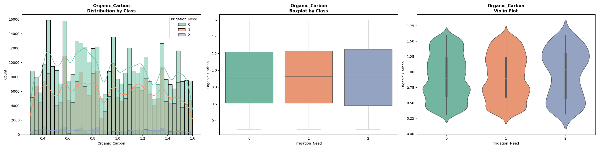
```
────────────────────────────────────────────────────────────
📌 Electrical_Conductivity
────────────────────────────────────────────────────────────
                    count   mean    std  min    1%    5%   10%   25%   50%   75%   90%   95%   99%  max
Irrigation_Need                                                                                        
0                369917.0  1.732  0.961  0.1  0.14  0.26  0.41  0.90  1.72  2.58  3.08  3.28  3.46  3.5
1                239074.0  1.769  0.943  0.1  0.14  0.27  0.46  0.97  1.76  2.59  3.06  3.26  3.46  3.5
2                 21009.0  1.691  0.891  0.1  0.24  0.39  0.52  0.95  1.65  2.37  2.99  3.23  3.45  3.5

   Aykırı değer sayısı (<1% veya >99%): 11830 (1.88%)
   Aykırı değerlerin sınıf dağılımı: {0: 7137, 1: 4488, 2: 205}

```
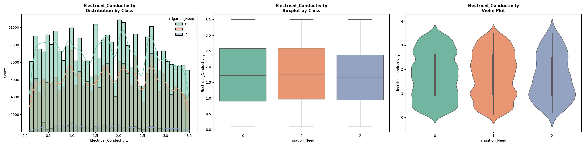
```
────────────────────────────────────────────────────────────
📌 Temperature_C
────────────────────────────────────────────────────────────
                    count    mean    std    min    1%      5%    10%    25%    50%    75%    90%    95%    99%    max
Irrigation_Need                                                                                                      
0                369917.0  25.348  8.365  12.00  12.2  13.080  14.48  18.27  24.54  31.77  37.95  39.81  41.56  42.00
1                239074.0  28.887  8.503  12.00  12.4  14.390  16.47  21.53  30.66  36.18  39.59  40.67  41.63  42.00
2                 21009.0  34.568  5.421  12.02  15.1  21.914  30.27  31.86  34.91  38.94  40.66  41.39  41.83  41.99

   Aykırı değer sayısı (<1% veya >99%): 12323 (1.96%)
   Aykırı değerlerin sınıf dağılımı: {0: 7587, 1: 4099, 2: 637}

```
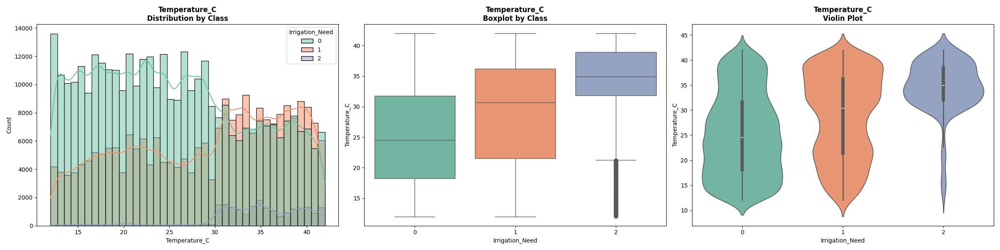
```
────────────────────────────────────────────────────────────
📌 Humidity
────────────────────────────────────────────────────────────
                    count    mean     std   min     1%      5%    10%    25%    50%    75%    90%    95%     99%    max
Irrigation_Need                                                                                                        
0                369917.0  61.949  19.913  25.0  26.31  29.858  35.11  44.94  61.77  79.45  88.42  92.05  94.560  94.99
1                239074.0  61.005  19.414  25.0  25.77  29.020  32.12  46.23  61.44  78.54  87.05  89.92  94.310  94.98
2                 21009.0  61.120  19.243  25.0  25.46  27.990  30.92  47.55  62.85  77.16  86.11  89.21  92.648  94.98

   Aykırı değer sayısı (<1% veya >99%): 12406 (1.97%)
   Aykırı değerlerin sınıf dağılımı: {0: 7113, 1: 4832, 2: 461}

```
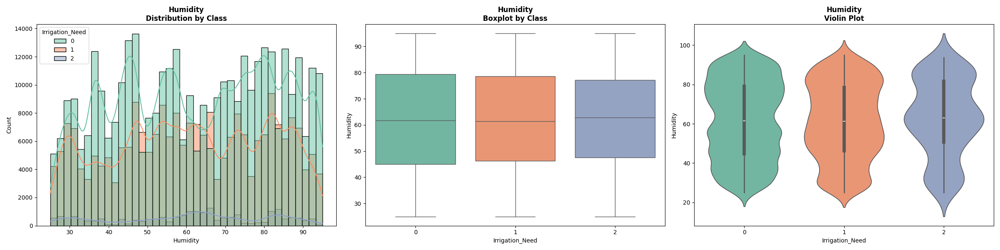
```
────────────────────────────────────────────────────────────
📌 Rainfall_mm
────────────────────────────────────────────────────────────
                    count      mean      std   min       1%      5%     10%      25%      50%      75%      90%       95%      99%      max
Irrigation_Need                                                                                                                            
0                369917.0  1500.534  584.805  1.85  459.910  579.96  698.67  1005.00  1498.88  2076.86  2298.21  2389.822  2476.59  2499.69
1                239074.0  1444.475  618.450  0.38   20.570  506.46  635.45   919.62  1463.59  2023.86  2307.03  2402.280  2480.46  2499.69
2                 21009.0   989.157  800.312  2.18    6.782   20.08   96.75   209.20   764.95  1705.68  2190.81  2338.830  2469.77  2499.69

   Aykırı değer sayısı (<1% veya >99%): 12539 (1.99%)
   Aykırı değerlerin sınıf dağılımı: {0: 3743, 1: 6535, 2: 2261}

```
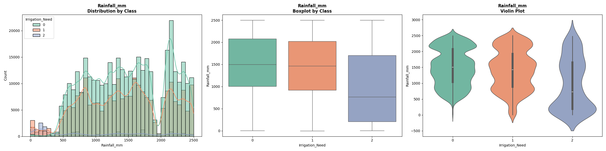
```
────────────────────────────────────────────────────────────
📌 Sunlight_Hours
────────────────────────────────────────────────────────────
                    count   mean    std  min    1%    5%   10%   25%   50%   75%    90%    95%    99%   max
Irrigation_Need                                                                                            
0                369917.0  7.511  2.000  4.0  4.06  4.39  4.68  5.76  7.58  9.26  10.22  10.56  10.89  11.0
1                239074.0  7.521  1.995  4.0  4.06  4.40  4.72  5.76  7.61  9.20  10.26  10.62  10.92  11.0
2                 21009.0  7.463  2.031  4.0  4.09  4.45  4.92  5.64  7.48  9.08  10.44  10.69  10.93  11.0

   Aykırı değer sayısı (<1% veya >99%): 11289 (1.79%)
   Aykırı değerlerin sınıf dağılımı: {0: 6439, 1: 4472, 2: 378}

```
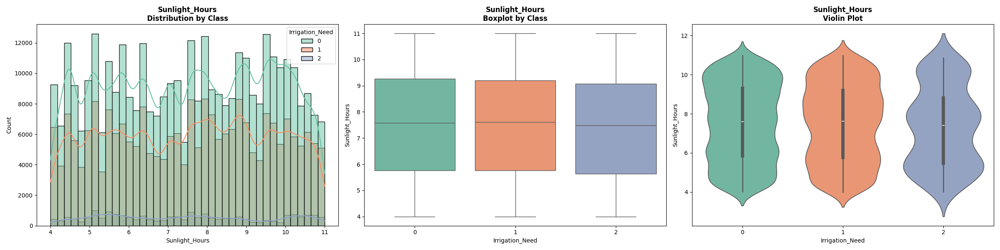
```
────────────────────────────────────────────────────────────
📌 Wind_Speed_kmh
────────────────────────────────────────────────────────────
                    count    mean    std  min    1%     5%    10%    25%    50%    75%    90%    95%    99%   max
Irrigation_Need                                                                                                  
0                369917.0   9.216  5.632  0.5  0.73  1.330   2.07   4.32   8.42  14.29  17.56  18.69  19.70  20.0
1                239074.0  11.794  5.389  0.5  0.87  2.117   3.33   7.80  12.52  16.16  18.59  19.35  19.83  20.0
2                 21009.0  14.643  4.118  0.5  1.59  5.780  10.40  12.12  15.01  18.02  19.45  19.67  19.91  20.0

   Aykırı değer sayısı (<1% veya >99%): 12232 (1.94%)
   Aykırı değerlerin sınıf dağılımı: {0: 6939, 1: 4692, 2: 601}

```
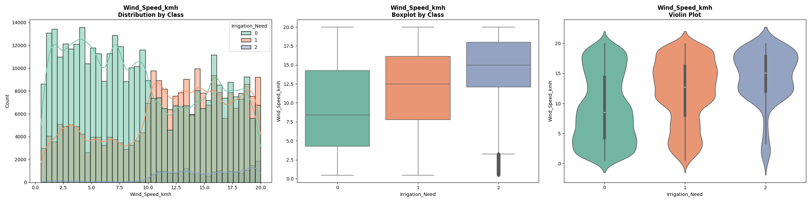
```
────────────────────────────────────────────────────────────
📌 Field_Area_hectare
────────────────────────────────────────────────────────────
                    count   mean    std   min    1%    5%   10%  25%   50%    75%    90%    95%    99%   max
Irrigation_Need                                                                                             
0                369917.0  7.447  4.197  0.31  0.47  1.00  1.71  3.9  7.25  11.04  13.41  14.23  14.86  15.0
1                239074.0  7.626  4.225  0.30  0.47  1.06  1.82  3.9  7.56  11.23  13.47  14.24  14.92  15.0
2                 21009.0  7.530  4.477  0.30  0.40  0.91  1.54  3.4  7.49  11.66  13.66  14.30  14.94  15.0

   Aykırı değer sayısı (<1% veya >99%): 12118 (1.92%)
   Aykırı değerlerin sınıf dağılımı: {0: 6687, 1: 4792, 2: 639}

```
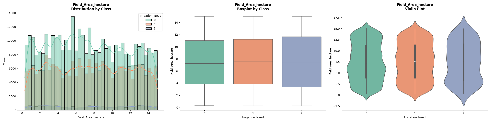
```
────────────────────────────────────────────────────────────
📌 Previous_Irrigation_mm
────────────────────────────────────────────────────────────
                    count    mean     std   min    1%     5%     10%    25%    50%    75%     90%      95%     99%     max
Irrigation_Need                                                                                                           
0                369917.0  61.718  35.548  0.02  2.02   7.36  13.756  30.95  59.38  94.90  110.48  113.380  118.25  119.99
1                239074.0  63.182  32.295  0.02  3.64  12.89  18.900  34.87  62.20  90.47  107.76  112.070  118.55  119.99
2                 21009.0  63.053  32.197  0.02  1.43   6.40  17.700  34.88  66.65  88.82  104.56  108.226  118.25  119.88

   Aykırı değer sayısı (<1% veya >99%): 12441 (1.97%)
   Aykırı değerlerin sınıf dağılımı: {0: 7561, 1: 4357, 2: 523}

```
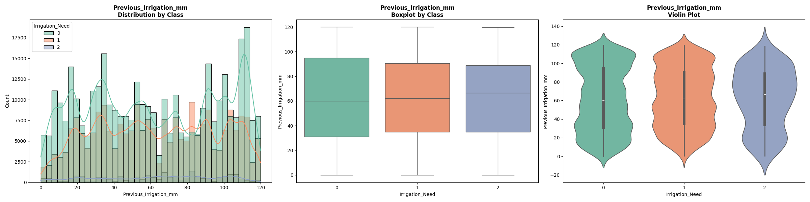
```
================================================================================
📊 KATEGORİK DEĞİŞKENLER - SINIF BAZINDA ANALİZ
================================================================================

────────────────────────────────────────────────────────────
📌 Soil_Type
────────────────────────────────────────────────────────────
            count  target_mean  target_std  count_pct
Soil_Type                                            
Sandy      166509       0.4623      0.5709      26.43
Clay       158470       0.4481      0.5634      25.15
Silt       148566       0.4435      0.5545      23.58
Loamy      156455       0.4296      0.5502      24.83

```
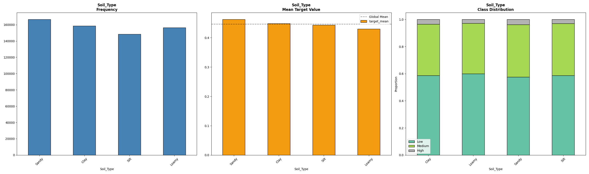
```
────────────────────────────────────────────────────────────
📌 Crop_Type
────────────────────────────────────────────────────────────
            count  target_mean  target_std  count_pct
Crop_Type                                            
Maize      104274       0.4721      0.5776      16.55
Potato     102469       0.4515      0.5500      16.26
Cotton     104645       0.4489      0.5653      16.61
Sugarcane  108910       0.4463      0.5705      17.29
Wheat      103005       0.4352      0.5561      16.35
Rice       106697       0.4235      0.5393      16.94

```
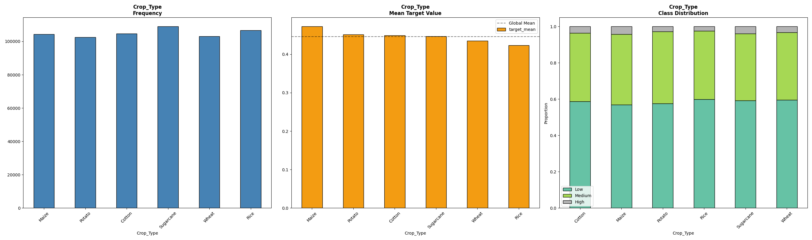
```
────────────────────────────────────────────────────────────
📌 Crop_Growth_Stage
────────────────────────────────────────────────────────────
                    count  target_mean  target_std  count_pct
Crop_Growth_Stage                                            
Flowering          157563       0.7584      0.5586      25.01
Vegetative         157246       0.7403      0.5661      24.96
Harvest            167689       0.1553      0.3709      26.62
Sowing             147502       0.1298      0.3409      23.41

```
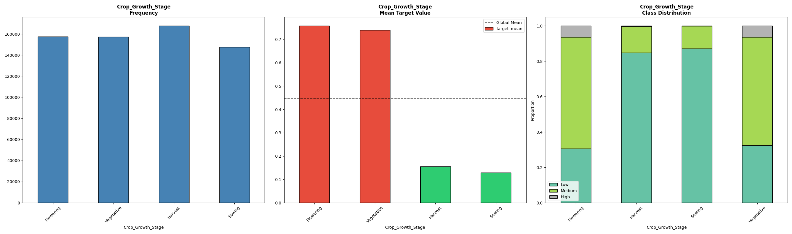
```
────────────────────────────────────────────────────────────
📌 Season
────────────────────────────────────────────────────────────
         count  target_mean  target_std  count_pct
Season                                            
Kharif  216561       0.4635      0.5642      34.37
Zaid    205406       0.4419      0.5592      32.60
Rabi    208033       0.4323      0.5565      33.02

```
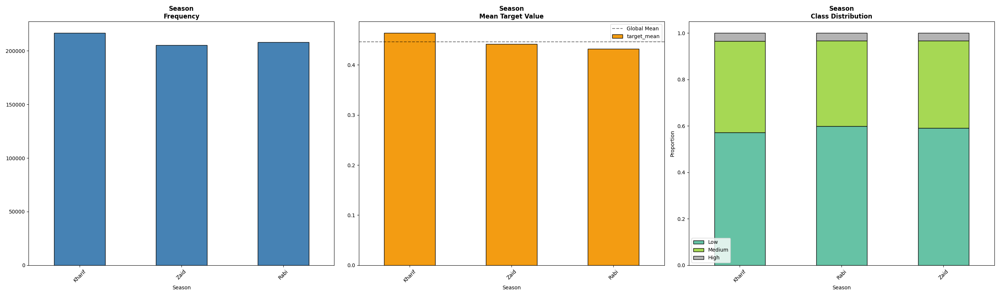
```
────────────────────────────────────────────────────────────
📌 Irrigation_Type
────────────────────────────────────────────────────────────
                  count  target_mean  target_std  count_pct
Irrigation_Type                                            
Canal            161901       0.4802      0.5709      25.70
Sprinkler        161400       0.4442      0.5627      25.62
Drip             151092       0.4321      0.5466      23.98
Rainfed          155607       0.4265      0.5576      24.70

```
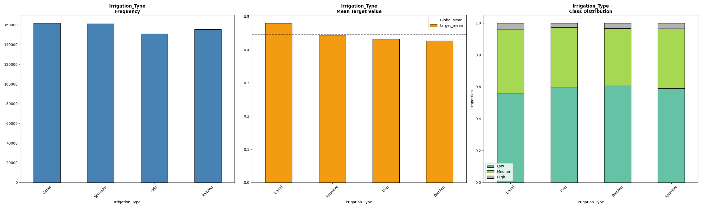
```
────────────────────────────────────────────────────────────
📌 Water_Source
────────────────────────────────────────────────────────────
               count  target_mean  target_std  count_pct
Water_Source                                            
Reservoir     162994       0.4700      0.5607      25.87
River         159819       0.4604      0.5791      25.37
Rainwater     153032       0.4298      0.5587      24.29
Groundwater   154155       0.4225      0.5394      24.47

```
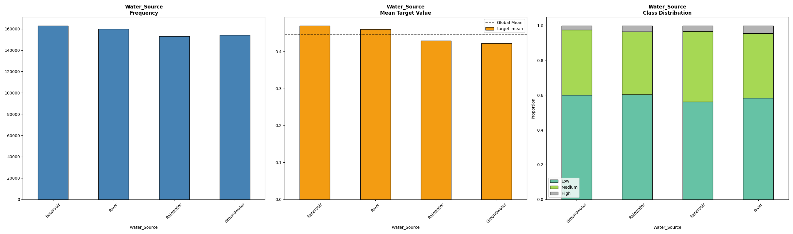
```
────────────────────────────────────────────────────────────
📌 Mulching_Used
────────────────────────────────────────────────────────────
                count  target_mean  target_std  count_pct
Mulching_Used                                            
No             316453       0.6135      0.5951      50.23
Yes            313547       0.2773      0.4651      49.77

```
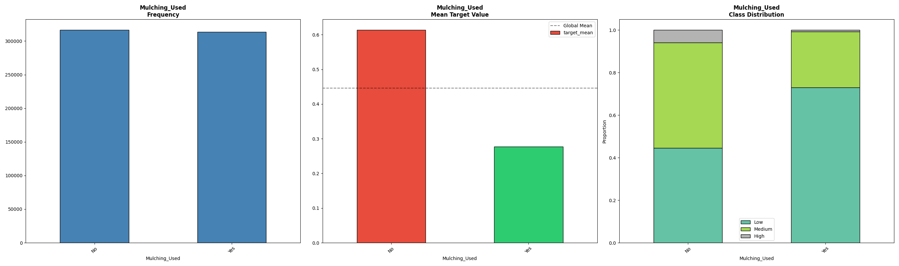
```
────────────────────────────────────────────────────────────
📌 Region
────────────────────────────────────────────────────────────
          count  target_mean  target_std  count_pct
Region                                             
North    114127       0.4580      0.5628      18.12
West     131189       0.4488      0.5627      20.82
South    134809       0.4482      0.5629      21.40
Central  123712       0.4413      0.5615      19.64
East     126163       0.4352      0.5506      20.03

```
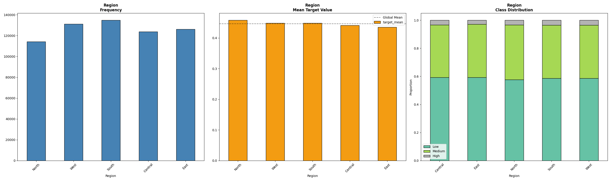
```
================================================================================
📊 TEK DEĞİŞKENLİ ÖNEM ANALİZİ
================================================================================

📈 Sayısal Değişken Önem Sıralaması:
                            F_value  F_pvalue  Mutual_Info  MI_Rank
Soil_Moisture            82555.9179    0.0000       0.2053        1
Rainfall_mm               7241.6312    0.0000       0.1882        2
Temperature_C            22043.7591    0.0000       0.0734        3
Wind_Speed_kmh           22514.0942    0.0000       0.0632        4
Previous_Irrigation_mm     137.6441    0.0000       0.0515        5
Humidity                   172.2973    0.0000       0.0486        6
Electrical_Conductivity    146.9581    0.0000       0.0121        7
Organic_Carbon              16.1679    0.0000       0.0116        8
Field_Area_hectare         130.1552    0.0000       0.0099        9
Soil_pH                    158.2962    0.0000       0.0094       10
Sunlight_Hours               8.7403    0.0002       0.0085       11

📊 Kategorik Değişken Önem Sıralaması:
                          Chi2  p_value  Chi2_Rank
Crop_Growth_Stage  194378.5203      0.0          1
Mulching_Used       56876.9042      0.0          2
Water_Source         1642.7051      0.0          3
Irrigation_Type      1096.4527      0.0          4
Crop_Type            1094.9441      0.0          5
Soil_Type             406.3165      0.0          6
Season                373.4697      0.0          7
Region                188.5138      0.0          8

```
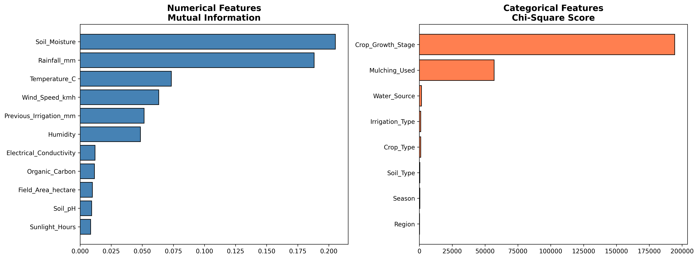
```

================================================================================
📊 KORELASYON ANALİZİ
================================================================================

```
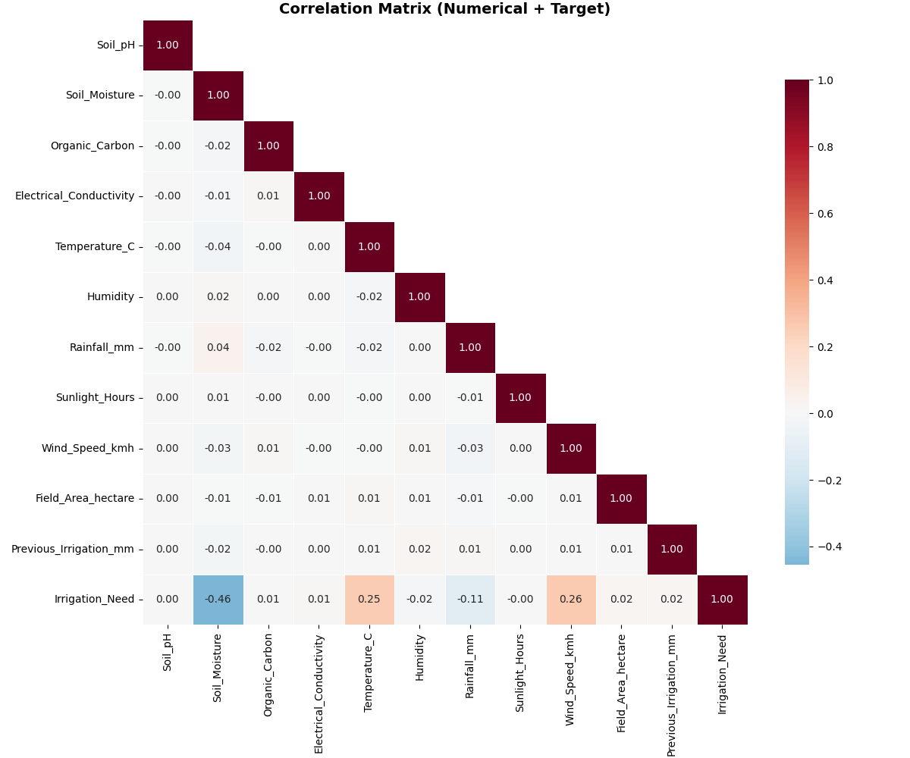
```

✅ Yüksek korelasyonlu çift yok (|r| > 0.7)

================================================================================
📊 İKİLİ ETKİLEŞİM ANALİZİ (Top 5 Sayısal)
================================================================================

```

```

================================================================================
📊 NULL IMPORTANCE ANALİZİ (CV‑Target Encoding ile)
================================================================================
Encoded features: 19

📈 Gerçek feature importance hesaplanıyor...

📉 Null importance hesaplanıyor (5 shuffle × 5 fold = 25 model)...
  Fold 1/5 tamamlandı (toplam 5 model)
  Fold 2/5 tamamlandı (toplam 10 model)
  Fold 3/5 tamamlandı (toplam 15 model)
  Fold 4/5 tamamlandı (toplam 20 model)
  Fold 5/5 tamamlandı (toplam 25 model)

📊 NULL IMPORTANCE SONUÇLARI (safe_score ile sıralı):
                    feature  actual_importance  null_95th  safe_score  is_significant
13        Crop_Growth_Stage           0.305259   0.060368    5.056639            True
1             Soil_Moisture           0.267910   0.056314    4.757435            True
4             Temperature_C           0.132932   0.057307    2.319639            True
17            Mulching_Used           0.141017   0.065597    2.149754            True
8            Wind_Speed_kmh           0.110757   0.057564    1.924068            True
6               Rainfall_mm           0.033497   0.057129    0.586331           False
10   Previous_Irrigation_mm           0.002957   0.054925    0.053837           False
16             Water_Source           0.002152   0.060836    0.035369           False
5                  Humidity           0.001221   0.058807    0.020756           False
0                   Soil_pH           0.000662   0.056139    0.011800           False
3   Electrical_Conductivity           0.000632   0.055810    0.011319           False
9        Field_Area_hectare           0.000307   0.057273    0.005369           False
7            Sunlight_Hours           0.000293   0.057084    0.005129           False
2            Organic_Carbon           0.000141   0.056299    0.002503           False
15          Irrigation_Type           0.000133   0.060774    0.002194           False
14                   Season           0.000085   0.064112    0.001327           False
12                Crop_Type           0.000045   0.058302    0.000778           False
11                Soil_Type           0.000000   0.064445    0.000000           False
18                   Region           0.000000   0.060314    0.000000           False

✅ Gerçekten önemli özellikler (actual > null_99th): 5
✅ 95th'den iyi özellikler: 5
❌ Gürültü olabilecekler: 14

```
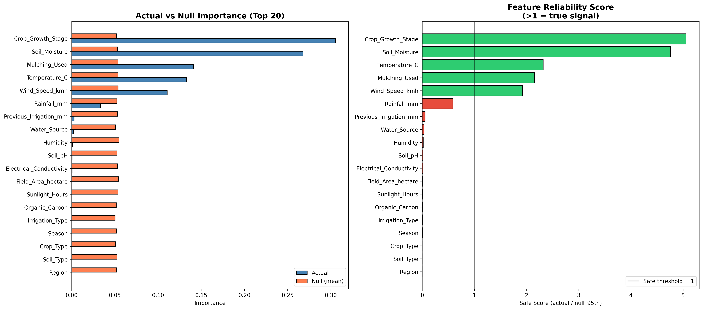
```

💡 ÖNERİLEN ÖZELLİKLER (istatistiksel anlamlı):
   ['Crop_Growth_Stage', 'Soil_Moisture', 'Temperature_C', 'Mulching_Used', 'Wind_Speed_kmh']

⚠️ ATILABİLİR ÖZELLİKLER (gürültü seviyesinde):
   ['Rainfall_mm', 'Previous_Irrigation_mm', 'Water_Source', 'Humidity', 'Soil_pH', 'Electrical_Conductivity', 'Field_Area_hectare', 'Sunlight_Hours', 'Organic_Carbon', 'Irrigation_Type', 'Season', 'Crop_Type', 'Soil_Type', 'Region']

================================================================================
📋 EDA ÖZETİ VE FEATURE ENGINEERING ÖNERİLERİ
================================================================================

🔍 VERİ SETİ ÖZETİ:
   • Toplam satır: 630,000
   • Sayısal: 11, Kategorik: 8
   • Hedef dengesizlik: 17.6x

📊 SAYISAL ÖZELLİKLER (Mutual Info sıralı):

   1. Soil_Moisture: 0.2053
   2. Rainfall_mm: 0.1882
   3. Temperature_C: 0.0734
   4. Wind_Speed_kmh: 0.0632
   5. Previous_Irrigation_mm: 0.0515
   6. Humidity: 0.0486
   7. Electrical_Conductivity: 0.0121
   8. Organic_Carbon: 0.0116
   9. Field_Area_hectare: 0.0099
   10. Soil_pH: 0.0094
   11. Sunlight_Hours: 0.0085

📊 KATEGORİK ÖZELLİKLER (Chi-Square sıralı):
   1. Crop_Growth_Stage: 194378.52
   2. Mulching_Used: 56876.90
   3. Water_Source: 1642.71
   4. Irrigation_Type: 1096.45
   5. Crop_Type: 1094.94
   6. Soil_Type: 406.32
   7. Season: 373.47
   8. Region: 188.51

📊 NULL IMPORTANCE (safe_score > 1):
   ✓ Crop_Growth_Stage: safe_score=5.06
   ✓ Soil_Moisture: safe_score=4.76
   ✓ Temperature_C: safe_score=2.32
   ✓ Mulching_Used: safe_score=2.15
   ✓ Wind_Speed_kmh: safe_score=1.92

```