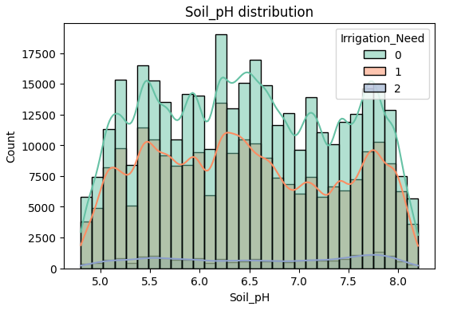
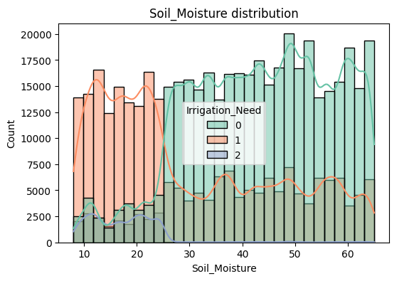
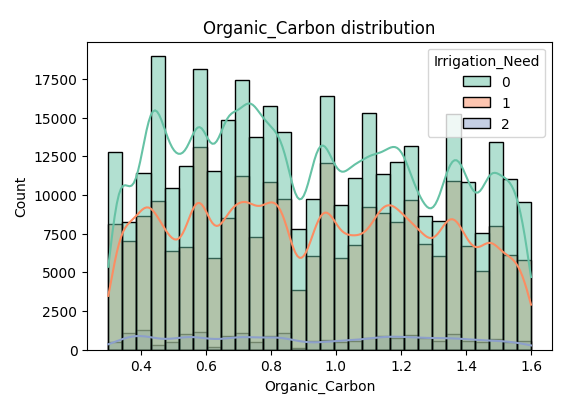
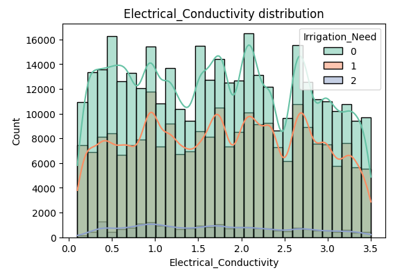

# BASIC INFORMATION ABOUT THE DATASET

🔍 SHAPE: (630000, 20)

📌 INFO:
```
<class 'pandas.core.frame.DataFrame'>
RangeIndex: 630000 entries, 0 to 629999
Data columns (total 20 columns):
 #   Column                   Non-Null Count   Dtype  
---  ------                   --------------   -----  
 0   Soil_Type                630000 non-null  object 
 1   Soil_pH                  630000 non-null  float64
 2   Soil_Moisture            630000 non-null  float64
 3   Organic_Carbon           630000 non-null  float64
 4   Electrical_Conductivity  630000 non-null  float64
 5   Temperature_C            630000 non-null  float64
 6   Humidity                 630000 non-null  float64
 7   Rainfall_mm              630000 non-null  float64
 8   Sunlight_Hours           630000 non-null  float64
 9   Wind_Speed_kmh           630000 non-null  float64
 10  Crop_Type                630000 non-null  object 
 11  Crop_Growth_Stage        630000 non-null  object 
 12  Season                   630000 non-null  object 
 13  Irrigation_Type          630000 non-null  object 
 14  Water_Source             630000 non-null  object 
 15  Field_Area_hectare       630000 non-null  float64
 16  Mulching_Used            630000 non-null  object 
 17  Previous_Irrigation_mm   630000 non-null  float64
 18  Region                   630000 non-null  object 
 19  Irrigation_Need          630000 non-null  int64  
dtypes: float64(11), int64(1), object(8)
memory usage: 96.1+ MB
```

**Target class distribution:**

|0|1|2|
|:---:|:---:|:---:|
|369917|239074|21009|

✅ No missing values.

**Numerical columns (11):**

['Soil_pH', 'Soil_Moisture', 'Organic_Carbon', 'Electrical_Conductivity',
 'Temperature_C', 'Humidity', 'Rainfall_mm', 'Sunlight_Hours',
 'Wind_Speed_kmh', 'Field_Area_hectare', 'Previous_Irrigation_mm']

**Categorical columns (8):**

['Soil_Type', 'Crop_Type', 'Crop_Growth_Stage', 'Season',
 'Irrigation_Type', 'Water_Source', 'Mulching_Used', 'Region']

**Numerical Features**
| Feature                  | count   | mean     | std      | min  | 1%   | 5%    | 25%   | 50%   | 75%   | 95%   | 99%   | max   |
|--------------------------|---------|----------|----------|------|------|-------|-------|-------|-------|-------|-------|-------|
| Soil_pH                 | 630000  | 6.482497 | 0.922504 | 4.80 | 4.87 | 5.060 | 5.690 | 6.44  | 7.27  | 7.95  | 8.12  | 8.20  |
| Soil_Moisture           | 630000  | 37.304482| 16.377082| 8.00 | 8.63 | 11.290| 23.340| 37.75 | 51.27 | 62.35 | 64.62 | 64.99 |
| Organic_Carbon          | 630000  | 0.922858 | 0.365808 | 0.30 | 0.32 | 0.370 | 0.610 | 0.91  | 1.22  | 1.52  | 1.58  | 1.60  |
| Electrical_Conductivity | 630000  | 1.744605 | 0.952321 | 0.10 | 0.14 | 0.270 | 0.930 | 1.74  | 2.58  | 3.27  | 3.46  | 3.50  |
| Temperature_C           | 630000  | 26.998166| 8.623621 | 12.00| 12.27| 13.440| 19.517| 26.96 | 34.54 | 40.34 | 41.60 | 42.00 |
| Humidity                | 630000  | 61.563180| 19.708152| 25.00| 25.98| 29.540| 45.390| 61.65 | 79.12 | 91.48 | 94.48 | 94.99 |
| Rainfall_mm             | 630000  | 1462.207566| 612.989738| 0.38 | 98.28| 521.539| 954.570| 1467.16| 2054.28| 2390.17| 2479.86| 2499.69 |
| Sunlight_Hours          | 630000  | 7.513382 | 1.999322 | 4.00 | 4.06 | 4.400 | 5.760 | 7.58  | 9.25  | 10.59 | 10.91 | 11.00 |
| Wind_Speed_kmh          | 630000  | 10.375394| 5.689458 | 0.50 | 0.76 | 1.590 | 5.280 | 10.48 | 15.43 | 19.04 | 19.79 | 20.00 |
| Field_Area_hectare      | 630000  | 7.517745 | 4.218124 | 0.30 | 0.47 | 1.000 | 3.880 | 7.38  | 11.14 | 14.23 | 14.89 | 15.00 |
| Previous_Irrigation_mm  | 630000  | 62.318177| 34.246939| 0.02 | 2.55 | 9.040 | 33.140| 61.15 | 92.69 | 112.89| 118.36| 119.99 |
| Irrigation_Need         | 630000  | 0.446178 | 0.560178 | 0.00 | 0.00 | 0.000 | 0.000 | 0.00  | 1.00  | 1.00  | 2.00  | 2.00  |

**Categorical Features**
| Feature             | count  | unique | top        | freq   |
|---------------------|--------|--------|------------|--------|
| Soil_Type           | 630000 | 4      | Sandy      | 166509 |
| Crop_Type           | 630000 | 6      | Sugarcane  | 108910 |
| Crop_Growth_Stage   | 630000 | 4      | Harvest    | 167689 |
| Season              | 630000 | 3      | Kharif     | 216561 |
| Irrigation_Type     | 630000 | 4      | Canal      | 161901 |
| Water_Source        | 630000 | 4      | Reservoir  | 162994 |
| Mulching_Used       | 630000 | 2      | No         | 316453 |
| Region              | 630000 | 5      | South      | 134809 |

---

# NUMERIC FEATURES

## Soil_pH

| Irrigation_Need | count    | mean | std  | min | 1%   | 5%   | 10%  | 15%  | 25%  | 35%  | 50%  | 70%  | 75%  | 85%  | 90%  | 95%  | 99%  | max |
| --------------- | -------- | ---- | ---- | --- | ---- | ---- | ---- | ---- | ---- | ---- | ---- | ---- | ---- | ---- | ---- | ---- | ---- | --- |
| 0               | 369917.0 | 6.49 | 0.92 | 4.8 | 4.87 | 5.07 | 5.23 | 5.41 | 5.70 | 6.02 | 6.46 | 7.09 | 7.25 | 7.64 | 7.77 | 7.94 | 8.12 | 8.2 |
| 1               | 239074.0 | 6.47 | 0.93 | 4.8 | 4.87 | 5.06 | 5.23 | 5.40 | 5.67 | 5.97 | 6.40 | 7.06 | 7.25 | 7.66 | 7.79 | 7.96 | 8.12 | 8.2 |
| 2               | 21009.0  | 6.58 | 0.98 | 4.8 | 4.86 | 5.05 | 5.23 | 5.42 | 5.67 | 6.01 | 6.59 | 7.39 | 7.53 | 7.75 | 7.84 | 7.97 | 8.11 | 8.2 |

**F-statistic:** 158.30 | **p-value:** 0.0000


---

## Soil_Moisture

| Irrigation_Need | count    | mean  | std   | min  | 1%    | 5%    | 10%   | 15%   | 25%   | 35%   | 50%   | 70%   | 75%   | 85%   | 90%   | 95%   | 99%   | max   |
| --------------- | -------- | ----- | ----- | ---- | ----- | ----- | ----- | ----- | ----- | ----- | ----- | ----- | ----- | ----- | ----- | ----- | ----- | ----- |
| 0               | 369917.0 | 43.31 | 13.42 | 8.01 | 10.59 | 20.38 | 26.23 | 28.49 | 33.03 | 37.56 | 44.01 | 52.27 | 54.31 | 59.03 | 60.97 | 63.17 | 64.71 | 64.99 |
| 1               | 239074.0 | 29.74 | 16.62 | 8.00 | 8.34  | 9.65  | 11.48 | 12.63 | 16.03 | 19.16 | 23.89 | 38.94 | 43.66 | 51.91 | 56.37 | 60.01 | 64.30 | 64.99 |
| 2               | 21009.0  | 17.67 | 7.48  | 8.01 | 8.22  | 9.00  | 9.95  | 10.61 | 12.14 | 14.00 | 17.09 | 20.76 | 21.67 | 23.58 | 24.23 | 24.75 | 51.88 | 64.99 |

**F-statistic:** 82555.92 | **p-value:** 0.0000


---

## Organic_Carbon

| Irrigation_Need | count    | mean | std  | min | 1%   | 5%   | 10%  | 15%  | 25%  | 35%  | 50%  | 70%  | 75%  | 85%  | 90%  | 95%  | 99%  | max |
| --------------- | -------- | ---- | ---- | --- | ---- | ---- | ---- | ---- | ---- | ---- | ---- | ---- | ---- | ---- | ---- | ---- | ---- | --- |
| 0               | 369917.0 | 0.92 | 0.37 | 0.3 | 0.32 | 0.38 | 0.44 | 0.49 | 0.61 | 0.72 | 0.90 | 1.16 | 1.22 | 1.37 | 1.46 | 1.52 | 1.58 | 1.6 |
| 1               | 239074.0 | 0.93 | 0.36 | 0.3 | 0.32 | 0.37 | 0.43 | 0.49 | 0.61 | 0.73 | 0.93 | 1.17 | 1.23 | 1.37 | 1.44 | 1.51 | 1.58 | 1.6 |
| 2               | 21009.0  | 0.92 | 0.37 | 0.3 | 0.33 | 0.37 | 0.41 | 0.48 | 0.58 | 0.71 | 0.91 | 1.19 | 1.25 | 1.37 | 1.44 | 1.52 | 1.58 | 1.6 |

**F-statistic:** 16.17 | **p-value:** 0.0000

---

## Electrical_Conductivity

| Irrigation_Need | count    | mean | std  | min | 1%   | 5%   | 10%  | 15%  | 25%  | 35%  | 50%  | 70%  | 75%  | 85%  | 90%  | 95%  | 99%  | max |
| --------------- | -------- | ---- | ---- | --- | ---- | ---- | ---- | ---- | ---- | ---- | ---- | ---- | ---- | ---- | ---- | ---- | ---- | --- |
| 0               | 369917.0 | 1.73 | 0.96 | 0.1 | 0.14 | 0.26 | 0.41 | 0.57 | 0.90 | 1.21 | 1.72 | 2.34 | 2.58 | 2.90 | 3.08 | 3.28 | 3.46 | 3.5 |
| 1               | 239074.0 | 1.77 | 0.94 | 0.1 | 0.14 | 0.27 | 0.46 | 0.64 | 0.97 | 1.28 | 1.76 | 2.37 | 2.59 | 2.89 | 3.06 | 3.26 | 3.46 | 3.5 |
| 2               | 21009.0  | 1.69 | 0.89 | 0.1 | 0.24 | 0.39 | 0.52 | 0.69 | 0.95 | 1.17 | 1.65 | 2.21 | 2.37 | 2.76 | 2.99 | 3.23 | 3.45 | 3.5 |

**F-statistic:** 146.96 | **p-value:** 0.0000

---

## Temperature_C

| Irrigation_Need | count    | mean  | std  | min   | 1%   | 5%    | 10%   | 15%   | 25%   | 35%   | 50%   | 70%   | 75%   | 85%   | 90%   | 95%   | 99%   | max   |
| --------------- | -------- | ----- | ---- | ----- | ---- | ----- | ----- | ----- | ----- | ----- | ----- | ----- | ----- | ----- | ----- | ----- | ----- | ----- |
| 0               | 369917.0 | 25.35 | 8.36 | 12.00 | 12.2 | 13.08 | 14.48 | 15.74 | 18.27 | 20.74 | 24.54 | 30.00 | 31.77 | 35.86 | 37.95 | 39.81 | 41.56 | 42.00 |
| 1               | 239074.0 | 28.89 | 8.50 | 12.00 | 12.4 | 14.39 | 16.47 | 18.20 | 21.53 | 25.02 | 30.66 | 35.08 | 36.18 | 38.51 | 39.59 | 40.67 | 41.63 | 42.00 |
| 2               | 21009.0  | 34.57 | 5.42 | 12.02 | 15.1 | 21.91 | 30.27 | 30.74 | 31.86 | 33.19 | 34.91 | 37.95 | 38.94 | 39.94 | 40.66 | 41.39 | 41.83 | 41.99 |

**F-statistic:** 22043.76 | **p-value:** 0.0000

---

## Humidity

| Irrigation_Need | count    | mean  | std   | min  | 1%    | 5%    | 10%   | 15%   | 25%   | 35%   | 50%   | 70%   | 75%   | 85%   | 90%   | 95%   | 99%   | max   |
| --------------- | -------- | ----- | ----- | ---- | ----- | ----- | ----- | ----- | ----- | ----- | ----- | ----- | ----- | ----- | ----- | ----- | ----- | ----- |
| 0               | 369917.0 | 61.95 | 19.91 | 25.0 | 26.31 | 29.86 | 35.11 | 37.58 | 44.94 | 52.12 | 61.77 | 76.58 | 79.45 | 85.54 | 88.42 | 92.05 | 94.56 | 94.99 |
| 1               | 239074.0 | 61.00 | 19.41 | 25.0 | 25.77 | 29.02 | 32.12 | 37.18 | 46.23 | 52.35 | 61.44 | 74.30 | 78.54 | 83.60 | 87.05 | 89.92 | 94.31 | 94.98 |
| 2               | 21009.0  | 61.12 | 19.24 | 25.0 | 25.46 | 27.99 | 30.92 | 34.64 | 47.55 | 55.61 | 62.85 | 72.55 | 77.16 | 83.39 | 86.11 | 89.21 | 92.65 | 94.98 |

**F-statistic:** 172.30 | **p-value:** 0.0000

---

## Rainfall_mm

| Irrigation_Need | count    | mean    | std    | min  | 1%     | 5%     | 10%    | 15%    | 25%     | 35%     | 50%     | 70%     | 75%     | 85%     | 90%     | 95%     | 99%     | max     |
| --------------- | -------- | ------- | ------ | ---- | ------ | ------ | ------ | ------ | ------- | ------- | ------- | ------- | ------- | ------- | ------- | ------- | ------- | ------- |
| 0               | 369917.0 | 1500.53 | 584.80 | 1.85 | 459.91 | 579.96 | 698.67 | 813.19 | 1005.00 | 1216.76 | 1498.88 | 1848.63 | 2076.86 | 2199.16 | 2298.21 | 2389.82 | 2476.59 | 2499.69 |
| 1               | 239074.0 | 1444.48 | 618.45 | 0.38 | 20.57  | 506.46 | 635.45 | 754.68 | 919.62  | 1175.64 | 1463.59 | 1794.64 | 2023.86 | 2187.06 | 2307.03 | 2402.28 | 2480.46 | 2499.69 |
| 2               | 21009.0  | 989.16  | 800.31 | 2.18 | 6.78   | 20.08  | 96.75  | 157.25 | 209.20  | 289.14  | 764.95  | 1515.88 | 1705.68 | 2121.36 | 2190.81 | 2338.83 | 2469.77 | 2499.69 |

**F-statistic:** 7241.63 | **p-value:** 0.0000

---

## Sunlight_Hours

| Irrigation_Need | count    | mean | std  | min | 1%   | 5%   | 10%  | 15%  | 25%  | 35%  | 50%  | 70%  | 75%  | 85%   | 90%   | 95%   | 99%   | max  |
| --------------- | -------- | ---- | ---- | --- | ---- | ---- | ---- | ---- | ---- | ---- | ---- | ---- | ---- | ----- | ----- | ----- | ----- | ---- |
| 0               | 369917.0 | 7.51 | 2.00 | 4.0 | 4.06 | 4.39 | 4.68 | 5.08 | 5.76 | 6.43 | 7.58 | 8.95 | 9.26 | 9.91  | 10.22 | 10.56 | 10.89 | 11.0 |
| 1               | 239074.0 | 7.52 | 2.00 | 4.0 | 4.06 | 4.40 | 4.72 | 5.09 | 5.76 | 6.44 | 7.61 | 8.87 | 9.20 | 9.93  | 10.26 | 10.62 | 10.92 | 11.0 |
| 2               | 21009.0  | 7.46 | 2.03 | 4.0 | 4.09 | 4.45 | 4.92 | 5.17 | 5.64 | 6.28 | 7.48 | 8.72 | 9.08 | 10.16 | 10.44 | 10.69 | 10.93 | 11.0 |

**F-statistic:** 8.74 | **p-value:** 0.0002

---

## Wind_Speed_kmh

| Irrigation_Need | count    | mean  | std  | min | 1%   | 5%   | 10%   | 15%   | 25%   | 35%   | 50%   | 70%   | 75%   | 85%   | 90%   | 95%   | 99%   | max  |
| --------------- | -------- | ----- | ---- | --- | ---- | ---- | ----- | ----- | ----- | ----- | ----- | ----- | ----- | ----- | ----- | ----- | ----- | ---- |
| 0               | 369917.0 | 9.22  | 5.63 | 0.5 | 0.73 | 1.33 | 2.07  | 2.89  | 4.32  | 5.87  | 8.42  | 12.87 | 14.29 | 16.46 | 17.56 | 18.69 | 19.70 | 20.0 |
| 1               | 239074.0 | 11.79 | 5.39 | 0.5 | 0.87 | 2.12 | 3.33  | 4.64  | 7.80  | 10.37 | 12.52 | 15.49 | 16.16 | 17.81 | 18.59 | 19.35 | 19.83 | 20.0 |
| 2               | 21009.0  | 14.64 | 4.12 | 0.5 | 1.59 | 5.78 | 10.40 | 11.09 | 12.12 | 13.30 | 15.01 | 17.46 | 18.02 | 19.09 | 19.45 | 19.67 | 19.91 | 20.0 |

**F-statistic:** 22514.09 | **p-value:** 0.0000

---

## Field_Area_hectare

| Irrigation_Need | count    | mean | std  | min  | 1%   | 5%   | 10%  | 15%  | 25% | 35%  | 50%  | 70%   | 75%   | 85%   | 90%   | 95%   | 99%   | max  |
| --------------- | -------- | ---- | ---- | ---- | ---- | ---- | ---- | ---- | --- | ---- | ---- | ----- | ----- | ----- | ----- | ----- | ----- | ---- |
| 0               | 369917.0 | 7.45 | 4.20 | 0.31 | 0.47 | 1.00 | 1.71 | 2.52 | 3.9 | 5.30 | 7.25 | 10.30 | 11.04 | 12.67 | 13.41 | 14.23 | 14.86 | 15.0 |
| 1               | 239074.0 | 7.63 | 4.22 | 0.30 | 0.47 | 1.06 | 1.82 | 2.55 | 3.9 | 5.52 | 7.56 | 10.56 | 11.23 | 12.78 | 13.47 | 14.24 | 14.92 | 15.0 |
| 2               | 21009.0  | 7.53 | 4.48 | 0.30 | 0.40 | 0.91 | 1.54 | 2.16 | 3.4 | 4.93 | 7.49 | 10.83 | 11.66 | 13.09 | 13.66 | 14.30 | 14.94 | 15.0 |

**F-statistic:** 130.16 | **p-value:** 0.0000

---

## Previous_Irrigation_mm

| Irrigation_Need | count    | mean  | std   | min  | 1%   | 5%    | 10%   | 15%   | 25%   | 35%   | 50%   | 70%   | 75%   | 85%    | 90%    | 95%    | 99%    | max    |
| --------------- | -------- | ----- | ----- | ---- | ---- | ----- | ----- | ----- | ----- | ----- | ----- | ----- | ----- | ------ | ------ | ------ | ------ | ------ |
| 0               | 369917.0 | 61.72 | 35.55 | 0.02 | 2.02 | 7.36  | 13.76 | 18.38 | 30.95 | 40.79 | 59.38 | 90.20 | 94.90 | 107.11 | 110.48 | 113.38 | 118.25 | 119.99 |
| 1               | 239074.0 | 63.18 | 32.30 | 0.02 | 3.64 | 12.89 | 18.90 | 24.83 | 34.87 | 46.82 | 62.20 | 85.89 | 90.47 | 102.72 | 107.76 | 112.07 | 118.55 | 119.99 |
| 2               | 21009.0  | 63.05 | 32.20 | 0.02 | 1.43 | 6.40  | 17.70 | 21.55 | 34.88 | 51.67 | 66.65 | 83.59 | 88.82 | 100.96 | 104.56 | 108.23 | 118.25 | 119.88 |

**F-statistic:** 137.64 | **p-value:** 0.0000

---

# CATEGORICAL FEATURES

## Soil_Type

| Soil_Type | mean  | std   | count  |
| --------- | ----- | ----- | ------ |
| Clay      | 0.448 | 0.563 | 158470 |
| Loamy     | 0.430 | 0.550 | 156455 |
| Sandy     | 0.462 | 0.571 | 166509 |
| Silt      | 0.443 | 0.554 | 148566 |

**Chi-square:** 406.32 | **p-value:** 0.0000

---

## Crop_Type

| Crop_Type | mean  | std   | count  |
| --------- | ----- | ----- | ------ |
| Cotton    | 0.449 | 0.565 | 104645 |
| Maize     | 0.472 | 0.578 | 104274 |
| Potato    | 0.452 | 0.550 | 102469 |
| Rice      | 0.423 | 0.539 | 106697 |
| Sugarcane | 0.446 | 0.570 | 108910 |
| Wheat     | 0.435 | 0.556 | 103005 |

**Chi-square:** 1094.94 | **p-value:** 0.0000

---

## Crop_Growth_Stage

| Crop_Growth_Stage | mean  | std   | count  |
| ----------------- | ----- | ----- | ------ |
| Flowering         | 0.758 | 0.559 | 157563 |
| Harvest           | 0.155 | 0.371 | 167689 |
| Sowing            | 0.130 | 0.341 | 147502 |
| Vegetative        | 0.740 | 0.566 | 157246 |

**Chi-square:** 194378.52 | **p-value:** 0.0000

---

## Season

| Season | mean  | std   | count  |
| ------ | ----- | ----- | ------ |
| Kharif | 0.463 | 0.564 | 216561 |
| Rabi   | 0.432 | 0.556 | 208033 |
| Zaid   | 0.442 | 0.559 | 205406 |

**Chi-square:** 373.47 | **p-value:** 0.0000

---

## Irrigation_Type

| Type      | mean  | std   | count  |
| --------- | ----- | ----- | ------ |
| Canal     | 0.480 | 0.571 | 161901 |
| Drip      | 0.432 | 0.547 | 151092 |
| Rainfed   | 0.426 | 0.558 | 155607 |
| Sprinkler | 0.444 | 0.563 | 161400 |

**Chi-square:** 1096.45 | **p-value:** 0.0000

---

## Water_Source

| Source      | mean  | std   | count  |
| ----------- | ----- | ----- | ------ |
| Groundwater | 0.422 | 0.539 | 154155 |
| Rainwater   | 0.430 | 0.559 | 153032 |
| Reservoir   | 0.470 | 0.561 | 162994 |
| River       | 0.460 | 0.579 | 159819 |

**Chi-square:** 1642.71 | **p-value:** 0.0000

---

## Mulching_Used

| Used | mean  | std   | count  |
| ---- | ----- | ----- | ------ |
| No   | 0.613 | 0.595 | 316453 |
| Yes  | 0.277 | 0.465 | 313547 |

**Chi-square:** 56876.90 | **p-value:** 0.0000

---

## Region

| Region  | mean  | std   | count  |
| ------- | ----- | ----- | ------ |
| Central | 0.441 | 0.561 | 123712 |
| East    | 0.435 | 0.551 | 126163 |
| North   | 0.458 | 0.563 | 114127 |
| South   | 0.448 | 0.563 | 134809 |
| West    | 0.449 | 0.563 | 131189 |

**Chi-square:** 188.51 | **p-value:** 0.0000

---


# Base Results

```py 
import pandas as pd
import numpy as np
import matplotlib.pyplot as plt
import seaborn as sns
from sklearn.model_selection import StratifiedKFold, cross_val_score, train_test_split
from sklearn.pipeline import Pipeline
from sklearn.metrics import (balanced_accuracy_score, classification_report,
                             recall_score, fbeta_score, precision_score)
from sklearn.preprocessing import FunctionTransformer
from sklearn.base import BaseEstimator, TransformerMixin
from category_encoders import TargetEncoder
from xgboost import XGBClassifier
from sklearn.feature_selection import f_classif
from scipy.stats import chi2_contingency
from sklearn.utils.class_weight import compute_class_weight
import warnings
warnings.filterwarnings('ignore')

# =========================
# 1. LOAD DATA
# =========================
train = pd.read_csv("/kaggle/input/competitions/playground-series-s6e4/train.csv")
target = "Irrigation_Need"
idc = "id"

y = train[target].map({"Low": 0, "Medium": 1, "High": 2})
X_raw = train.drop([target, idc], axis=1)

# =========================
# 2. EDA (İsteğe bağlı)
# =========================
print("\n" + "="*80)
print("VERİ SETİ HAKKINDA TEMEL BİLGİLER")
print("="*80)
print(f"Toplam satır: {X_raw.shape[0]}")
print(f"Toplam sütun: {X_raw.shape[1]}")
print(f"Hedef sınıf dağılımı:\n{y.value_counts().sort_index().to_dict()}")

missing = X_raw.isnull().sum()
if missing.sum() > 0:
    print("\nEksik değer içeren sütunlar:\n", missing[missing>0])
else:
    print("\n✅ Hiç eksik değer yok.")

num_cols = X_raw.select_dtypes(include=np.number).columns.tolist()
cat_cols = X_raw.select_dtypes(include=['object', 'category']).columns.tolist()
print(f"\nSayısal sütunlar ({len(num_cols)} adet): {num_cols}")
print(f"Kategorik sütunlar ({len(cat_cols)} adet): {cat_cols}")

# Sayısal ilişkiler
for col in num_cols:
    print(f"\n--- {col} ---")
    group_stats = X_raw.groupby(y)[col].describe(percentiles=[.01,.05,.10,.15,.25,.35,.5,.70,.75,.85,.90,.95,.99])
    display(group_stats.round(2))
    f_val, p_val = f_classif(X_raw[[col]].fillna(0), y)
    print(f"F-değeri: {f_val[0]:.2f} | p-değeri: {p_val[0]:.4f}")

# Kategorik ilişkiler
for col in cat_cols:
    print(f"\n--- {col} ---")
    temp_df = pd.DataFrame({col: X_raw[col], 'target': y})
    cross = temp_df.groupby(col)['target'].agg(['mean', 'std', 'count'])
    display(cross.round(3))
    
    contingency = pd.crosstab(X_raw[col], y)
    chi2, p, dof, expected = chi2_contingency(contingency)
    print(f"Chi-kare: {chi2:.2f} | p-değeri: {p:.4f}")

# =========================
# 3. GENİŞLETİLMİŞ FEATURE ENGINEERING
# =========================
def fe(df):
    df = df.copy()
    
    return df

# =========================
# 4. TARGET ENCODER WRAPPER
# =========================
class CustomTargetEncoder(BaseEstimator, TransformerMixin):
    def __init__(self):
        self.encoder = None
        self.cat_cols_ = None

    def fit(self, X, y):
        self.cat_cols_ = X.select_dtypes(include=['object', 'category']).columns.tolist()
        self.encoder = TargetEncoder()
        self.encoder.fit(X[self.cat_cols_], y)
        return self

    def transform(self, X):
        X_out = X.copy()
        if self.cat_cols_:
            X_out[self.cat_cols_] = self.encoder.transform(X[self.cat_cols_])
        return X_out

# =========================
# 5. XGBOOST WRAPPER (sample_weight ile class_weight)
# =========================
class SampleWeightXGBClassifier(BaseEstimator, TransformerMixin):
    def __init__(self, **xgboost_params):
        self.model = XGBClassifier(**xgboost_params)
        self.class_weight_ = None

    def set_class_weight(self, class_weight_dict):
        self.class_weight_ = class_weight_dict

    def fit(self, X, y, sample_weight=None):
        if sample_weight is None and self.class_weight_ is not None:
            sample_weight = np.array([self.class_weight_[label] for label in y])
        self.model.fit(X, y, sample_weight=sample_weight)
        return self

    def predict(self, X):
        return self.model.predict(X)

    def predict_proba(self, X):
        return self.model.predict_proba(X)

# =========================
# 6. PİPELINE OLUŞTURMA
# =========================
def build_pipeline(class_weight_dict=None):
    target_enc_step = CustomTargetEncoder()
    
    model = SampleWeightXGBClassifier(
        n_estimators=500,
        max_depth=5,
        learning_rate=0.05,
        subsample=0.8,
        colsample_bytree=0.8,
        tree_method="hist",
        eval_metric="mlogloss",
        random_state=42
    )
    if class_weight_dict is not None:
        model.set_class_weight(class_weight_dict)
    
    pipeline = Pipeline([
        ("fe", FunctionTransformer(fe)),
        ("target_enc", target_enc_step),
        ("model", model)
    ])
    return pipeline

# =========================
# 7. THRESHOLD TUNING (F2 tabanlı)
# =========================
def find_best_threshold(pipe, X_val, y_val, class_of_interest=2,
                        thresholds=np.arange(0.05, 0.50, 0.025)):
    proba = pipe.predict_proba(X_val)
    best_thresh = 0.5
    best_f2 = -1
    
    for thresh in thresholds:
        y_pred_temp = np.zeros_like(y_val)
        for i in range(len(proba)):
            if proba[i, class_of_interest] >= thresh:
                y_pred_temp[i] = class_of_interest
            else:
                other_probs = np.array([proba[i, 0], proba[i, 1]])
                y_pred_temp[i] = np.argmax(other_probs)
        
        f2 = fbeta_score(y_val, y_pred_temp, labels=[class_of_interest],
                         average='micro', beta=2)
        if f2 > best_f2:
            best_f2 = f2
            best_thresh = thresh
    
    # Bilgi amaçlı recall ve precision
    y_pred_best = np.zeros_like(y_val)
    for i in range(len(proba)):
        if proba[i, class_of_interest] >= best_thresh:
            y_pred_best[i] = class_of_interest
        else:
            other_probs = np.array([proba[i, 0], proba[i, 1]])
            y_pred_best[i] = np.argmax(other_probs)
    rec = recall_score(y_val, y_pred_best, labels=[class_of_interest], average=None)[0]
    prec = precision_score(y_val, y_pred_best, labels=[class_of_interest], average=None)[0]
    
    print(f"Best threshold: {best_thresh:.3f} | F2: {best_f2:.4f} | Recall: {rec:.4f} | Precision: {prec:.4f}")
    return best_thresh, best_f2

# =========================
# 8. FEATURE IMPORTANCE YARDIMCISI
# =========================
def get_feature_importance(pipe, X_sample):
    """
    Pipeline'daki modelin feature importance'larını çıkarır.
    X_sample: pipeline'ın sonuna kadar işlenmiş bir satırlık DataFrame olabilir.
    """
    model = pipe.named_steps['model'].model
    importances = model.feature_importances_
    # İşlenmiş özellik isimlerini al
    fe_trans = pipe.named_steps['fe']
    X_fe = fe_trans.transform(X_sample)
    feature_names = X_fe.columns.tolist()
    imp_df = pd.DataFrame({'feature': feature_names, 'importance': importances})
    imp_df = imp_df.sort_values('importance', ascending=False)
    return imp_df

# =========================
# 9. ANA İŞLEM AKIŞI
# =========================
X = X_raw

# Sınıf ağırlıkları
classes = np.array([0, 1, 2])
class_weights = compute_class_weight('balanced', classes=classes, y=y)
class_weight_dict = dict(zip(classes, class_weights))
print("\nHesaplanan class weight:", class_weight_dict)
class_weight_dict[2] = class_weight_dict[2] * 1.5
print("Düzenlenmiş class weight:", class_weight_dict)

pipe = build_pipeline(class_weight_dict=class_weight_dict)

# Cross-validation
cv = StratifiedKFold(n_splits=5, shuffle=True, random_state=42)
scores = cross_val_score(pipe, X, y, cv=cv, scoring="balanced_accuracy")
print("\n" + "="*80)
print("CROSS VALIDATION SONUÇLARI (Sample Weight ile)")
print("="*80)
print("CV Score List:", scores)
print(f"CV Score Mean: {scores.mean():.4f} (±{scores.std():.4f})")

# Train/test split
X_train, X_test, y_train, y_test = train_test_split(X, y, test_size=0.33, random_state=42, stratify=y)

# Threshold tuning için ek validation split
X_train2, X_val, y_train2, y_val = train_test_split(X_train, y_train, test_size=0.2, random_state=42, stratify=y_train)
pipe.fit(X_train2, y_train2)
best_thresh, best_f2_val = find_best_threshold(pipe, X_val, y_val, class_of_interest=2)
print(f"\nSeçilen eşik: {best_thresh:.3f} (Validation F2: {best_f2_val:.4f})")

# Test değerlendirmesi için TÜM eğitim setiyle yeniden eğit
pipe.fit(X_train, y_train)

# Standart tahmin
y_pred_default = pipe.predict(X_test)

# Optimize threshold ile tahmin
proba_test = pipe.predict_proba(X_test)
y_pred_tuned = np.zeros_like(y_test)
for i in range(len(proba_test)):
    if proba_test[i, 2] >= best_thresh:
        y_pred_tuned[i] = 2
    else:
        other_probs = np.array([proba_test[i, 0], proba_test[i, 1]])
        y_pred_tuned[i] = np.argmax(other_probs)

print("\n" + "="*80)
print("TEST SONUÇLARI KARŞILAŞTIRMASI")
print("="*80)
print("Varsayılan threshold (0.5):")
print(classification_report(y_test, y_pred_default, digits=4))
print(f"Recall (Sınıf 2 - High): {recall_score(y_test, y_pred_default, labels=[2], average=None)[0]:.4f}")

print(f"\nOptimize threshold ({best_thresh:.2f}):")
print(classification_report(y_test, y_pred_tuned, digits=4))
print(f"Recall (Sınıf 2 - High): {recall_score(y_test, y_pred_tuned, labels=[2], average=None)[0]:.4f}")

ba_default = balanced_accuracy_score(y_test, y_pred_default)
ba_tuned = balanced_accuracy_score(y_test, y_pred_tuned)
print(f"\nBalanced Accuracy: Default={ba_default:.4f} , Tuned={ba_tuned:.4f}")

# =========================
# 10. FEATURE IMPORTANCE GÖRSELİ
# =========================
print("\n" + "="*80)
print("FEATURE IMPORTANCE")
print("="*80)
importance_df = get_feature_importance(pipe, X_train.head(1))
print(importance_df)

================================================================================
CROSS VALIDATION SONUÇLARI (Sample Weight ile)
================================================================================
CV Score List: [0.96163227 0.96309383 0.96174333 0.9621024  0.9612384 ]
CV Score Mean: 0.9620 (±0.0006)
Best threshold: 0.475 | F2: 0.9369 | Recall: 0.9588 | Precision: 0.8585

Seçilen eşik: 0.475 (Validation F2: 0.9369)

================================================================================
TEST SONUÇLARI KARŞILAŞTIRMASI
================================================================================
Varsayılan threshold (0.5):
              precision    recall  f1-score   support

           0     0.9862    0.9955    0.9908    122073
           1     0.9887    0.9657    0.9770     78894
           2     0.8676    0.9528    0.9082      6933

    accuracy                         0.9828    207900
   macro avg     0.9475    0.9713    0.9587    207900
weighted avg     0.9832    0.9828    0.9829    207900

Recall (Sınıf 2 - High): 0.9528

Optimize threshold (0.48):
              precision    recall  f1-score   support

           0     0.9862    0.9955    0.9908    122073
           1     0.9889    0.9642    0.9764     78894
           2     0.8548    0.9556    0.9024      6933

    accuracy                         0.9823    207900
   macro avg     0.9433    0.9718    0.9565    207900
weighted avg     0.9829    0.9823    0.9824    207900

Recall (Sınıf 2 - High): 0.9556

Balanced Accuracy: Default=0.9713 , Tuned=0.9718

================================================================================
FEATURE IMPORTANCE
================================================================================
                    feature  importance
2             Soil_Moisture    0.266234
11        Crop_Growth_Stage    0.222861
16            Mulching_Used    0.184472
5             Temperature_C    0.116613
9            Wind_Speed_kmh    0.090941
7               Rainfall_mm    0.053888
4   Electrical_Conductivity    0.005965
17   Previous_Irrigation_mm    0.005934
1                   Soil_pH    0.005723
6                  Humidity    0.005156
13          Irrigation_Type    0.005142
3            Organic_Carbon    0.004941
14             Water_Source    0.004906
10                Crop_Type    0.004894
8            Sunlight_Hours    0.004862
0                 Soil_Type    0.004666
15       Field_Area_hectare    0.004321
12                   Season    0.004309
18                   Region    0.004172
```

# FE Result

```py 
import pandas as pd
import numpy as np
import matplotlib.pyplot as plt
import seaborn as sns
from sklearn.model_selection import StratifiedKFold, cross_val_score, train_test_split
from sklearn.pipeline import Pipeline
from sklearn.metrics import (balanced_accuracy_score, classification_report,
                             recall_score, fbeta_score, precision_score)
from sklearn.preprocessing import FunctionTransformer
from sklearn.base import BaseEstimator, TransformerMixin
from category_encoders import TargetEncoder
from xgboost import XGBClassifier
from sklearn.feature_selection import f_classif
from scipy.stats import chi2_contingency
from sklearn.utils.class_weight import compute_class_weight
import warnings
warnings.filterwarnings('ignore')

# =========================
# 1. LOAD DATA
# =========================
train = pd.read_csv("/kaggle/input/competitions/playground-series-s6e4/train.csv")
target = "Irrigation_Need"
idc = "id"

y = train[target].map({"Low": 0, "Medium": 1, "High": 2})
X_raw = train.drop([target, idc], axis=1)

# =========================
# 2. EDA (İsteğe bağlı)
# =========================
print("\n" + "="*80)
print("VERİ SETİ HAKKINDA TEMEL BİLGİLER")
print("="*80)
print(f"Toplam satır: {X_raw.shape[0]}")
print(f"Toplam sütun: {X_raw.shape[1]}")
print(f"Hedef sınıf dağılımı:\n{y.value_counts().sort_index().to_dict()}")

missing = X_raw.isnull().sum()
if missing.sum() > 0:
    print("\nEksik değer içeren sütunlar:\n", missing[missing>0])
else:
    print("\n✅ Hiç eksik değer yok.")

num_cols = X_raw.select_dtypes(include=np.number).columns.tolist()
cat_cols = X_raw.select_dtypes(include=['object', 'category']).columns.tolist()
print(f"\nSayısal sütunlar ({len(num_cols)} adet): {num_cols}")
print(f"Kategorik sütunlar ({len(cat_cols)} adet): {cat_cols}")

# Sayısal ilişkiler
for col in num_cols:
    print(f"\n--- {col} ---")
    group_stats = X_raw.groupby(y)[col].describe(percentiles=[.01,.05,.10,.15,.25,.35,.5,.70,.75,.85,.90,.95,.99])
    display(group_stats.round(2))
    f_val, p_val = f_classif(X_raw[[col]].fillna(0), y)
    print(f"F-değeri: {f_val[0]:.2f} | p-değeri: {p_val[0]:.4f}")

# Kategorik ilişkiler
for col in cat_cols:
    print(f"\n--- {col} ---")
    temp_df = pd.DataFrame({col: X_raw[col], 'target': y})
    cross = temp_df.groupby(col)['target'].agg(['mean', 'std', 'count'])
    display(cross.round(3))
    
    contingency = pd.crosstab(X_raw[col], y)
    chi2, p, dof, expected = chi2_contingency(contingency)
    print(f"Chi-kare: {chi2:.2f} | p-değeri: {p:.4f}")

# =========================
# 3. GENİŞLETİLMİŞ FEATURE ENGINEERING
# =========================
def fe(df):
    df = df.copy()
    
    df['Evaporation_Risk'] = df['Temperature_C'] * df['Wind_Speed_kmh']
    df['Effective_Water'] = df['Soil_Moisture'] + df['Rainfall_mm']/100
    df['Stress_Index'] = df['Evaporation_Risk'] / (df['Soil_Moisture'] + 1)
    
    return df

# =========================
# 4. TARGET ENCODER WRAPPER
# =========================
class CustomTargetEncoder(BaseEstimator, TransformerMixin):
    def __init__(self):
        self.encoder = None
        self.cat_cols_ = None

    def fit(self, X, y):
        self.cat_cols_ = X.select_dtypes(include=['object', 'category']).columns.tolist()
        self.encoder = TargetEncoder()
        self.encoder.fit(X[self.cat_cols_], y)
        return self

    def transform(self, X):
        X_out = X.copy()
        if self.cat_cols_:
            X_out[self.cat_cols_] = self.encoder.transform(X[self.cat_cols_])
        return X_out

# =========================
# 5. XGBOOST WRAPPER (sample_weight ile class_weight)
# =========================
class SampleWeightXGBClassifier(BaseEstimator, TransformerMixin):
    def __init__(self, **xgboost_params):
        self.model = XGBClassifier(**xgboost_params)
        self.class_weight_ = None

    def set_class_weight(self, class_weight_dict):
        self.class_weight_ = class_weight_dict

    def fit(self, X, y, sample_weight=None):
        if sample_weight is None and self.class_weight_ is not None:
            sample_weight = np.array([self.class_weight_[label] for label in y])
        self.model.fit(X, y, sample_weight=sample_weight)
        return self

    def predict(self, X):
        return self.model.predict(X)

    def predict_proba(self, X):
        return self.model.predict_proba(X)

# =========================
# 6. PİPELINE OLUŞTURMA
# =========================
def build_pipeline(class_weight_dict=None):
    target_enc_step = CustomTargetEncoder()
    
    model = SampleWeightXGBClassifier(
        n_estimators=500,
        max_depth=5,
        learning_rate=0.05,
        subsample=0.8,
        colsample_bytree=0.8,
        tree_method="hist",
        eval_metric="mlogloss",
        random_state=42
    )
    if class_weight_dict is not None:
        model.set_class_weight(class_weight_dict)
    
    pipeline = Pipeline([
        ("fe", FunctionTransformer(fe)),
        ("target_enc", target_enc_step),
        ("model", model)
    ])
    return pipeline

# =========================
# 7. THRESHOLD TUNING (F2 tabanlı)
# =========================
def find_best_threshold(pipe, X_val, y_val, class_of_interest=2,
                        thresholds=np.arange(0.05, 0.50, 0.025)):
    proba = pipe.predict_proba(X_val)
    best_thresh = 0.5
    best_f2 = -1
    
    for thresh in thresholds:
        y_pred_temp = np.zeros_like(y_val)
        for i in range(len(proba)):
            if proba[i, class_of_interest] >= thresh:
                y_pred_temp[i] = class_of_interest
            else:
                other_probs = np.array([proba[i, 0], proba[i, 1]])
                y_pred_temp[i] = np.argmax(other_probs)
        
        f2 = fbeta_score(y_val, y_pred_temp, labels=[class_of_interest],
                         average='micro', beta=2)
        if f2 > best_f2:
            best_f2 = f2
            best_thresh = thresh
    
    # Bilgi amaçlı recall ve precision
    y_pred_best = np.zeros_like(y_val)
    for i in range(len(proba)):
        if proba[i, class_of_interest] >= best_thresh:
            y_pred_best[i] = class_of_interest
        else:
            other_probs = np.array([proba[i, 0], proba[i, 1]])
            y_pred_best[i] = np.argmax(other_probs)
    rec = recall_score(y_val, y_pred_best, labels=[class_of_interest], average=None)[0]
    prec = precision_score(y_val, y_pred_best, labels=[class_of_interest], average=None)[0]
    
    print(f"Best threshold: {best_thresh:.3f} | F2: {best_f2:.4f} | Recall: {rec:.4f} | Precision: {prec:.4f}")
    return best_thresh, best_f2

# =========================
# 8. FEATURE IMPORTANCE YARDIMCISI
# =========================
def get_feature_importance(pipe, X_sample):
    """
    Pipeline'daki modelin feature importance'larını çıkarır.
    X_sample: pipeline'ın sonuna kadar işlenmiş bir satırlık DataFrame olabilir.
    """
    model = pipe.named_steps['model'].model
    importances = model.feature_importances_
    # İşlenmiş özellik isimlerini al
    fe_trans = pipe.named_steps['fe']
    X_fe = fe_trans.transform(X_sample)
    feature_names = X_fe.columns.tolist()
    imp_df = pd.DataFrame({'feature': feature_names, 'importance': importances})
    imp_df = imp_df.sort_values('importance', ascending=False)
    return imp_df

# =========================
# 9. ANA İŞLEM AKIŞI
# =========================
X = X_raw

# Sınıf ağırlıkları
classes = np.array([0, 1, 2])
class_weights = compute_class_weight('balanced', classes=classes, y=y)
class_weight_dict = dict(zip(classes, class_weights))
print("\nHesaplanan class weight:", class_weight_dict)
class_weight_dict[2] = class_weight_dict[2] * 1.5
print("Düzenlenmiş class weight:", class_weight_dict)

pipe = build_pipeline(class_weight_dict=class_weight_dict)

# Cross-validation
cv = StratifiedKFold(n_splits=5, shuffle=True, random_state=42)
scores = cross_val_score(pipe, X, y, cv=cv, scoring="balanced_accuracy")
print("\n" + "="*80)
print("CROSS VALIDATION SONUÇLARI (Sample Weight ile)")
print("="*80)
print("CV Score List:", scores)
print(f"CV Score Mean: {scores.mean():.4f} (±{scores.std():.4f})")

# Train/test split
X_train, X_test, y_train, y_test = train_test_split(X, y, test_size=0.33, random_state=42, stratify=y)

# Threshold tuning için ek validation split
X_train2, X_val, y_train2, y_val = train_test_split(X_train, y_train, test_size=0.2, random_state=42, stratify=y_train)
pipe.fit(X_train2, y_train2)
best_thresh, best_f2_val = find_best_threshold(pipe, X_val, y_val, class_of_interest=2)
print(f"\nSeçilen eşik: {best_thresh:.3f} (Validation F2: {best_f2_val:.4f})")

# Test değerlendirmesi için TÜM eğitim setiyle yeniden eğit
pipe.fit(X_train, y_train)

# Standart tahmin
y_pred_default = pipe.predict(X_test)

# Optimize threshold ile tahmin
proba_test = pipe.predict_proba(X_test)
y_pred_tuned = np.zeros_like(y_test)
for i in range(len(proba_test)):
    if proba_test[i, 2] >= best_thresh:
        y_pred_tuned[i] = 2
    else:
        other_probs = np.array([proba_test[i, 0], proba_test[i, 1]])
        y_pred_tuned[i] = np.argmax(other_probs)

print("\n" + "="*80)
print("TEST SONUÇLARI KARŞILAŞTIRMASI")
print("="*80)
print("Varsayılan threshold (0.5):")
print(classification_report(y_test, y_pred_default, digits=4))
print(f"Recall (Sınıf 2 - High): {recall_score(y_test, y_pred_default, labels=[2], average=None)[0]:.4f}")

print(f"\nOptimize threshold ({best_thresh:.2f}):")
print(classification_report(y_test, y_pred_tuned, digits=4))
print(f"Recall (Sınıf 2 - High): {recall_score(y_test, y_pred_tuned, labels=[2], average=None)[0]:.4f}")

ba_default = balanced_accuracy_score(y_test, y_pred_default)
ba_tuned = balanced_accuracy_score(y_test, y_pred_tuned)
print(f"\nBalanced Accuracy: Default={ba_default:.4f} , Tuned={ba_tuned:.4f}")

# =========================
# 10. FEATURE IMPORTANCE GÖRSELİ
# =========================
print("\n" + "="*80)
print("FEATURE IMPORTANCE")
print("="*80)
importance_df = get_feature_importance(pipe, X_train.head(1))
print(importance_df)

# CROSS VALIDATION RESULTS (With Sample Weight)

**CV Scores:**

[0.96078057, 0.96218969, 0.96165082, 0.96139807, 0.96035926]


**Mean CV Score:** 0.9613 (±0.0006)

**Best threshold:** 0.475
**F2 Score:** 0.9338
**Recall:** 0.9538
**Precision:** 0.8614

Selected threshold: **0.475**

---

## TEST RESULTS COMPARISON

### Default threshold (0.5)

| Class | precision | recall | f1-score | support |
| ----- | --------- | ------ | -------- | ------- |
| 0     | 0.9862    | 0.9954 | 0.9908   | 122073  |
| 1     | 0.9884    | 0.9658 | 0.9770   | 78894   |
| 2     | 0.8682    | 0.9511 | 0.9078   | 6933    |

**Accuracy:** 0.9827

---

### Optimized threshold (0.48)

| Class | precision | recall | f1-score | support |
| ----- | --------- | ------ | -------- | ------- |
| 0     | 0.9862    | 0.9954 | 0.9908   | 122073  |
| 1     | 0.9885    | 0.9643 | 0.9762   | 78894   |
| 2     | 0.8550    | 0.9524 | 0.9011   | 6933    |

**Accuracy:** 0.9822

---

## FEATURE IMPORTANCE

| Feature                 | Importance |
| ----------------------- | ---------- |
| Crop_Growth_Stage       | 0.222552   |
| Stress_Index            | 0.185063   |
| Soil_Moisture           | 0.162753   |
| Mulching_Used           | 0.146156   |
| Temperature_C           | 0.063818   |
| Rainfall_mm             | 0.047974   |
| Wind_Speed_kmh          | 0.041819   |
| Evaporation_Risk        | 0.040293   |
| Effective_Water         | 0.037424   |
| Previous_Irrigation_mm  | 0.004708   |
| Electrical_Conductivity | 0.004617   |
| Soil_pH                 | 0.004501   |
| Humidity                | 0.004278   |
| Water_Source            | 0.004134   |
| Sunlight_Hours          | 0.004128   |
| Crop_Type               | 0.003987   |
| Irrigation_Type         | 0.003946   |
| Soil_Type               | 0.003908   |
| Organic_Carbon          | 0.003800   |
| Season                  | 0.003437   |
| Field_Area_hectare      | 0.003436   |
| Region                  | 0.003270   |
```

Feature engineering is not working. On the contrary, it is causing overfitting.

# Three Model Combining

```python
import pandas as pd
import numpy as np
from sklearn.model_selection import StratifiedKFold, train_test_split
from sklearn.pipeline import Pipeline
from sklearn.preprocessing import FunctionTransformer
from sklearn.base import BaseEstimator, TransformerMixin
from sklearn.metrics import (balanced_accuracy_score, classification_report,
                             recall_score, precision_score, fbeta_score)
from sklearn.utils.class_weight import compute_class_weight
from category_encoders import TargetEncoder
from xgboost import XGBClassifier
from lightgbm import LGBMClassifier
import matplotlib.pyplot as plt
import seaborn as sns
import warnings
warnings.filterwarnings('ignore')

# =========================
# 1. VERİ YÜKLE
# =========================
train = pd.read_csv("/kaggle/input/competitions/playground-series-s6e4/train.csv")
test = pd.read_csv("/kaggle/input/competitions/playground-series-s6e4/test.csv")

target = "Irrigation_Need"
idc = "id"

y = train[target].map({"Low": 0, "Medium": 1, "High": 2})
X = train.drop([target, idc], axis=1)
X_test = test.drop([idc], axis=1)

# =========================
# 2. FEATURE ENGINEERING (İKİ VERSİYON)
# =========================
def fe_minimal(df):
    """Model 1 için sade bir FE – sadece en önemli etkileşimler, ikili flag yok."""
    df = df.copy()
    df['Evaporation_Risk'] = df['Temperature_C'] * df['Wind_Speed_kmh'] / (df['Humidity'] + 1)
    df['Water_Deficit'] = df['Rainfall_mm'] - df['Previous_Irrigation_mm']
    df['Moisture_Per_Temp'] = df['Soil_Moisture'] / (df['Temperature_C'] + 1)
    df['Temp_Wind'] = df['Temperature_C'] * df['Wind_Speed_kmh']
    return df

def fe_none(df):
    """Model 2 ve 3 için – hiç FE yok."""
    return df.copy()

# =========================
# 3. TARGET ENCODER WRAPPER
# =========================
class CustomTargetEncoder(BaseEstimator, TransformerMixin):
    def __init__(self):
        self.encoder = None
        self.cat_cols_ = None

    def fit(self, X, y):
        self.cat_cols_ = X.select_dtypes(include=['object', 'category']).columns.tolist()
        if self.cat_cols_:
            self.encoder = TargetEncoder()
            self.encoder.fit(X[self.cat_cols_], y)
        return self

    def transform(self, X):
        X_out = X.copy()
        if self.cat_cols_:
            X_out[self.cat_cols_] = self.encoder.transform(X[self.cat_cols_])
        return X_out

# =========================
# 4. MODEL SARICILAR (sample_weight için)
# =========================
class SampleWeightXGBClassifier(BaseEstimator, TransformerMixin):
    def __init__(self, **params):
        self.model = XGBClassifier(**params)
        self.class_weight_ = None

    def set_class_weight(self, cw):
        self.class_weight_ = cw

    def fit(self, X, y, sample_weight=None):
        if sample_weight is None and self.class_weight_ is not None:
            sample_weight = np.array([self.class_weight_[label] for label in y])
        self.model.fit(X, y, sample_weight=sample_weight)
        return self

    def predict(self, X):
        return self.model.predict(X)

    def predict_proba(self, X):
        return self.model.predict_proba(X)

class SampleWeightLGBMClassifier(BaseEstimator, TransformerMixin):
    """LGBM için class_weight parametresini sample_weight'e dönüştüren sarmalayıcı."""
    def __init__(self, **params):
        self.model = LGBMClassifier(**params)
        self.class_weight_ = None

    def set_class_weight(self, cw):
        self.class_weight_ = cw

    def fit(self, X, y, sample_weight=None):
        if sample_weight is None and self.class_weight_ is not None:
            sample_weight = np.array([self.class_weight_[label] for label in y])
        self.model.fit(X, y, sample_weight=sample_weight)
        return self

    def predict(self, X):
        return self.model.predict(X)

    def predict_proba(self, X):
        return self.model.predict_proba(X)

# =========================
# 5. PIPELINE KURUCULARI
# =========================
def build_xgb_pipeline(fe_func, class_weight_dict=None, **xgb_params):
    model = SampleWeightXGBClassifier(
        n_estimators=500,
        max_depth=5,
        learning_rate=0.05,
        subsample=0.8,
        colsample_bytree=0.8,
        tree_method="hist",
        eval_metric="mlogloss",
        random_state=42,
        **xgb_params
    )
    if class_weight_dict is not None:
        model.set_class_weight(class_weight_dict)
    return Pipeline([
        ("fe", FunctionTransformer(fe_func)),
        ("target_enc", CustomTargetEncoder()),
        ("model", model)
    ])

def build_lgbm_pipeline(fe_func, class_weight_dict=None, **lgbm_params):
    model = SampleWeightLGBMClassifier(
        n_estimators=700,
        learning_rate=0.05,
        max_depth=-1,
        num_leaves=64,
        subsample=0.8,
        colsample_bytree=0.8,
        random_state=42,
        **lgbm_params
    )
    if class_weight_dict is not None:
        model.set_class_weight(class_weight_dict)
    return Pipeline([
        ("fe", FunctionTransformer(fe_func)),
        ("target_enc", CustomTargetEncoder()),
        ("model", model)
    ])

# =========================
# 6. OOF & TEST TAHMİN FONKSİYONU
# =========================
def get_oof_test_preds(pipe, X, y, X_test, n_splits=5, seed=42):
    """
    StratifiedKFold ile OOF (out-of-fold) probability'leri ve 
    test seti için ortalama probability'leri döndürür.
    """
    cv = StratifiedKFold(n_splits=n_splits, shuffle=True, random_state=seed)
    n_classes = y.nunique()
    oof_preds = np.zeros((len(X), n_classes))
    test_preds = np.zeros((len(X_test), n_classes))

    for fold, (train_idx, val_idx) in enumerate(cv.split(X, y)):
        X_tr, X_val = X.iloc[train_idx], X.iloc[val_idx]
        y_tr, y_val = y.iloc[train_idx], y.iloc[val_idx]

        pipe_clone = Pipeline(pipe.steps)  # her fold için temiz kopya
        pipe_clone.fit(X_tr, y_tr)

        oof_preds[val_idx] = pipe_clone.predict_proba(X_val)
        test_preds += pipe_clone.predict_proba(X_test) / n_splits

        print(f"  Fold {fold+1} tamamlandı.")

    return oof_preds, test_preds

# =========================
# 7. ÇOK‑SINIFLI EŞİK OPTİMİZASYONU
# =========================
def dual_threshold_search(proba, y_true, t2_range=np.arange(0.3, 0.65, 0.025), 
                         t1_range=np.arange(0.3, 0.75, 0.025), beta=2):
    """
    proba: (n_samples, 3) olasılık matrisi
    y_true: gerçek etiketler
    t2_range: class 2 için eşik aralığı
    t1_range: class 1 için eşik aralığı
    beta: F-beta skorunda recall ağırlığı (2 = F2)
    """
    best_f2 = -1
    best_t2, best_t1 = 0.5, 0.5

    for t2 in t2_range:
        for t1 in t1_range:
            preds = np.zeros(len(proba), dtype=int)
            for i in range(len(proba)):
                if proba[i, 2] > t2:
                    preds[i] = 2
                elif proba[i, 1] > t1:
                    preds[i] = 1
                else:
                    preds[i] = 0
            f2 = fbeta_score(y_true, preds, average='micro', beta=beta)
            if f2 > best_f2:
                best_f2 = f2
                best_t2, best_t1 = t2, t1

    # En iyi eşiklerle metrikleri yazdır
    final_preds = np.zeros(len(proba), dtype=int)
    for i in range(len(proba)):
        if proba[i, 2] > best_t2:
            final_preds[i] = 2
        elif proba[i, 1] > best_t1:
            final_preds[i] = 1
        else:
            final_preds[i] = 0

    print(f"En iyi eşikler: t2={best_t2:.3f}, t1={best_t1:.3f} | F{beta}: {best_f2:.4f}")
    print("Seçilen eşiklerle metrikler:")
    print(classification_report(y_true, final_preds, digits=4))
    return best_t2, best_t1

# =========================
# 8. ANA ENSEMBLE İŞLEMİ
# =========================
# --- Sınıf ağırlıkları (balanced + High sınıfına vurgu) ---
classes = np.array([0, 1, 2])
class_weights = compute_class_weight('balanced', classes=classes, y=y)
class_weight_dict = dict(zip(classes, class_weights))
class_weight_dict[2] *= 2.0   # High sınıfına daha fazla ağırlık (1.5, 2, 3 denenebilir)
print("Kullanılan class_weight:", class_weight_dict)

# --- Model havuzu ---
pipelines = {
    "XGB_minFE": build_xgb_pipeline(fe_minimal, class_weight_dict),
    "XGB_raw":   build_xgb_pipeline(fe_none, class_weight_dict),
    "LGBM_raw":  build_lgbm_pipeline(fe_none, class_weight_dict)
}

# --- OOF ve test tahminleri ---
oof_dict = {}
test_dict = {}

for name, pipe in pipelines.items():
    print(f"\n{'='*60}\n{name} modeli OOF üretiliyor...")
    oof, test_pred = get_oof_test_preds(pipe, X, y, X_test, n_splits=5)
    oof_dict[name] = oof
    test_dict[name] = test_pred

# --- OOF üzerinde blending ağırlık optimizasyonu (grid search) ---
from itertools import product

best_f2 = -1
best_w = None

weights_range = np.linspace(0.1, 0.5, 5)  # her model ağırlığı 0.1 - 0.5 arası
for w1, w2, w3 in product(weights_range, repeat=3):
    if abs(w1 + w2 + w3 - 1.0) > 1e-3:
        continue
    blended_oof = (w1 * oof_dict["XGB_minFE"] +
                   w2 * oof_dict["XGB_raw"] +
                   w3 * oof_dict["LGBM_raw"])
    # OOF üzerinde F2 hesapla (micro average)
    preds = np.argmax(blended_oof, axis=1)  # geçici olarak argmax ile değerlendir
    f2 = fbeta_score(y, preds, average='micro', beta=2)
    if f2 > best_f2:
        best_f2 = f2
        best_w = (w1, w2, w3)

print(f"\nEn iyi blending ağırlıkları: XGB_minFE={best_w[0]:.2f}, XGB_raw={best_w[1]:.2f}, LGBM_raw={best_w[2]:.2f} | F2: {best_f2:.4f}")

# --- Test seti için blended olasılıklar ---
blended_test = (best_w[0] * test_dict["XGB_minFE"] +
                best_w[1] * test_dict["XGB_raw"] +
                best_w[2] * test_dict["LGBM_raw"])

# --- Çok‑sınıflı eşik optimizasyonu (OOF üzerinde) ---
blended_oof = (best_w[0] * oof_dict["XGB_minFE"] +
               best_w[1] * oof_dict["XGB_raw"] +
               best_w[2] * oof_dict["LGBM_raw"])
best_t2, best_t1 = dual_threshold_search(blended_oof, y)

# --- Test setinde son tahmin ---
final_preds_test = np.zeros(len(X_test), dtype=int)
for i in range(len(blended_test)):
    if blended_test[i, 2] > best_t2:
        final_preds_test[i] = 2
    elif blended_test[i, 1] > best_t1:
        final_preds_test[i] = 1
    else:
        final_preds_test[i] = 0

# --- Submisson dosyası ---
sub = pd.DataFrame({
    'id': test['id'],
    'Irrigation_Need': final_preds_test
})
sub['Irrigation_Need'] = sub['Irrigation_Need'].map({0: 'Low', 1: 'Medium', 2: 'High'})
sub.to_csv("ensemble_submission.csv", index=False)
print("\n✅ Submission dosyası kaydedildi: ensemble_submission.csv")
```

Kullanılan class_weight: {np.int64(0): np.float64(0.5676949153458749), np.int64(1): np.float64(0.8783891180136694), np.int64(2): np.float64(19.99143224332429)}

============================================================
XGB_minFE modeli OOF üretiliyor...
  Fold 1 tamamlandı.
  Fold 2 tamamlandı.
  Fold 3 tamamlandı.
  Fold 4 tamamlandı.
  Fold 5 tamamlandı.

============================================================
XGB_raw modeli OOF üretiliyor...
  Fold 1 tamamlandı.
  Fold 2 tamamlandı.
  Fold 3 tamamlandı.
  Fold 4 tamamlandı.
  Fold 5 tamamlandı.

============================================================
LGBM_raw modeli OOF üretiliyor...
[LightGBM] [Info] Auto-choosing col-wise multi-threading, the overhead of testing was 0.036467 seconds.
You can set `force_col_wise=true` to remove the overhead.
[LightGBM] [Info] Total Bins 2704
[LightGBM] [Info] Number of data points in the train set: 504000, number of used features: 19
[LightGBM] [Info] Start training from score -1.386319
[LightGBM] [Info] Start training from score -1.386318
[LightGBM] [Info] Start training from score -0.693123
  Fold 1 tamamlandı.
[LightGBM] [Info] Auto-choosing col-wise multi-threading, the overhead of testing was 0.033906 seconds.
You can set `force_col_wise=true` to remove the overhead.
[LightGBM] [Info] Total Bins 2705
[LightGBM] [Info] Number of data points in the train set: 504000, number of used features: 19
[LightGBM] [Info] Start training from score -1.386291
[LightGBM] [Info] Start training from score -1.386285
[LightGBM] [Info] Start training from score -0.693154
  Fold 2 tamamlandı.
[LightGBM] [Info] Auto-choosing col-wise multi-threading, the overhead of testing was 0.032343 seconds.
You can set `force_col_wise=true` to remove the overhead.
[LightGBM] [Info] Total Bins 2704
[LightGBM] [Info] Number of data points in the train set: 504000, number of used features: 19
[LightGBM] [Info] Start training from score -1.386287
[LightGBM] [Info] Start training from score -1.386290
[LightGBM] [Info] Start training from score -0.693153
  Fold 3 tamamlandı.
[LightGBM] [Info] Auto-choosing row-wise multi-threading, the overhead of testing was 0.009433 seconds.
You can set `force_row_wise=true` to remove the overhead.
And if memory is not enough, you can set `force_col_wise=true`.
[LightGBM] [Info] Total Bins 2705
[LightGBM] [Info] Number of data points in the train set: 504000, number of used features: 19
[LightGBM] [Info] Start training from score -1.386287
[LightGBM] [Info] Start training from score -1.386290
[LightGBM] [Info] Start training from score -0.693153
  Fold 4 tamamlandı.
[LightGBM] [Info] Auto-choosing col-wise multi-threading, the overhead of testing was 0.032659 seconds.
You can set `force_col_wise=true` to remove the overhead.
[LightGBM] [Info] Total Bins 2706
[LightGBM] [Info] Number of data points in the train set: 504000, number of used features: 19
[LightGBM] [Info] Start training from score -1.386287
[LightGBM] [Info] Start training from score -1.386290
[LightGBM] [Info] Start training from score -0.693153
  Fold 5 tamamlandı.

##  Evaluation
En iyi blending ağırlıkları: XGB_minFE=0.30, XGB_raw=0.20, LGBM_raw=0.50 | F2: 0.9838
En iyi eşikler: t2=0.625, t1=0.375 | F2: 0.9843
Seçilen eşiklerle metrikler:
              precision    recall  f1-score   support

           0     0.9864    0.9941    0.9902    369917
           1     0.9852    0.9732    0.9791    239074
           2     0.9364    0.9370    0.9367     21009

    accuracy                         0.9843    630000
   macro avg     0.9693    0.9681    0.9687    630000
weighted avg     0.9843    0.9843    0.9842    630000


1. Overall performance evaluation

Final results:

Accuracy: 0.9843
Macro F1: ~0.9687
Class 2 (High):
Precision: 0.936
Recall: 0.937
F1: 0.936

This means:

The model has learned very well
Performance is strong even for the minority class (High)
Ensemble + threshold tuning made a significant contribution

1. Feature Engineering (FE) impact — critical point

XGB_minFE vs XGB_raw
MinFE model:
Additional features: Evaporation_Risk, Water_Deficit, etc.
Raw model:
Only original features

📌 Ensemble weights:

XGB_minFE = 0.30
XGB_raw   = 0.20
LGBM_raw  = 0.50

👉 This shows:

The model with FE contributes the least
The strongest model is LGBM raw (no FE)
📌 What does this indicate?

In this dataset:

The original features already carry very strong signal

FE:
is likely redundant
may add noise
or may create unnecessary correlations for tree models

💡 Tree-based models (XGB/LGBM):

already learn interactions internally
manual feature engineering is often not beneficial and can even be harmful.

1. Is there a sign of overfitting?

Yes, there is a small but important signal:

Suspicious point:
OOF F2: 0.9838
CV-like score in earlier outputs: ~0.961

👉 If the gap is large:

due to ensemble + threshold tuning
not leakage, but:
OOF optimization may be too adapted to validation distribution